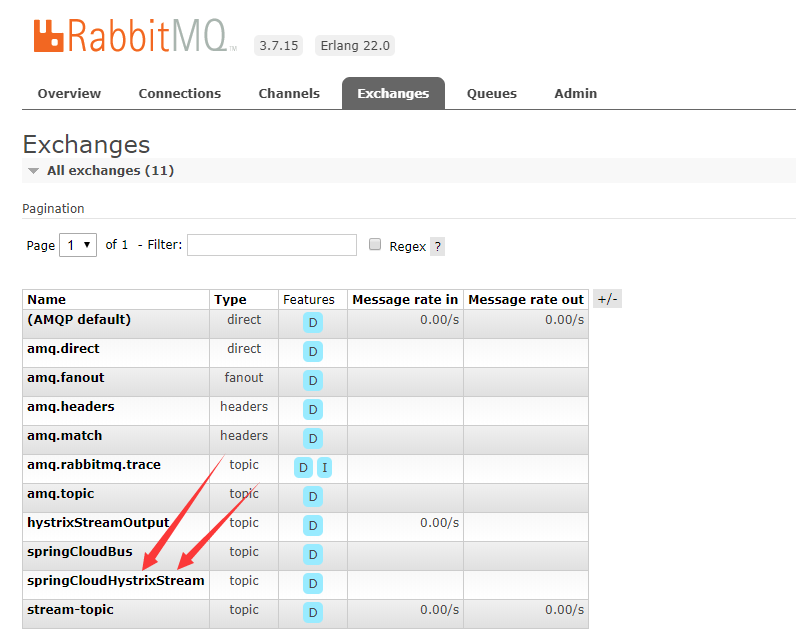
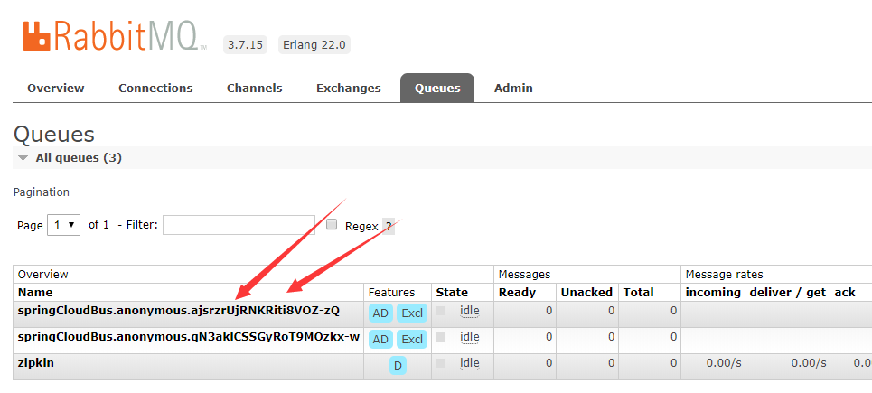
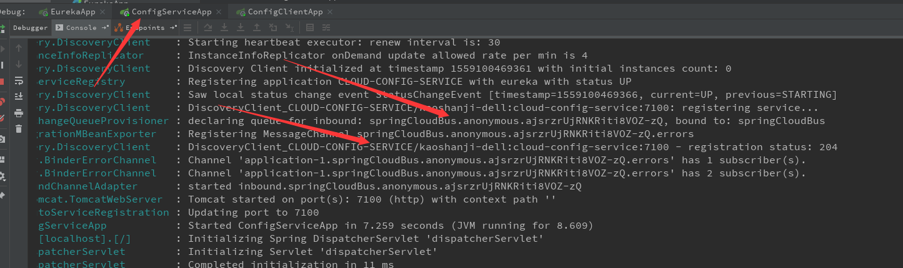
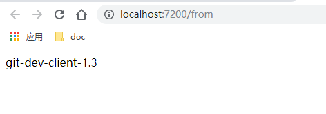
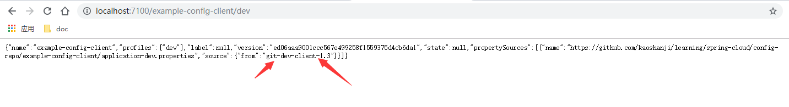

#   配置3：消息发布配置-RabbitMQ


##  效果

让RabbitMQ通知相关应用配置信息


##  项目列表
-   cloud-eureka-service：服务治理中心，第一个启动
-   cloud-config-service：服务配置中心服务端，其次启动
-   example-config-client：服务配置客户端示例，其次启动，如果启动报错，就先访问：http://localhost:7100/example-config-client/dev

- spring cloud ：
  - spring-cloud-stream-binder-rabbit：集成RabbitMQ
  - spring-cloud-bus：消息总线

##  访问

进入 RabbitMQ 控制台：http://localhost:15672/  账户：guest/guest







-   客户端REST查看配置信息：http://localhost:7200/from
    -   对应的是：application-dev.properties 里面的信息
    -   效果：
-   服务端查看：http://localhost:7100/example-config-client/test
    -   上述路径结尾是test，查看application-test.properties
    -   换成：dev、prod试试
    -   效果：


**动态刷新**

使用 Git 客户端修改 config-repo/example-config-client 下 application-dev.properties 文件并提交

````
// 控制台

curl -X POST http://localhost:7100/actuator/bus-refresh/

````

再刷新 http://localhost:7200/from ，可以看到信息保持同步了

##  备注

