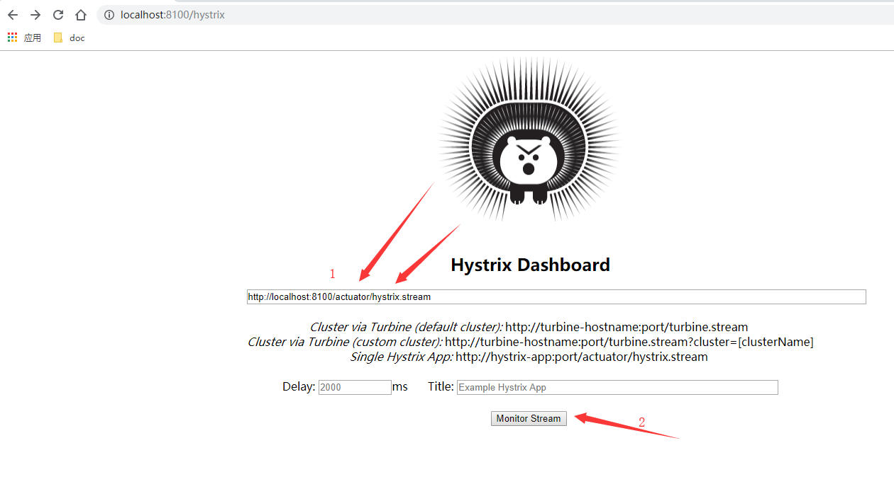
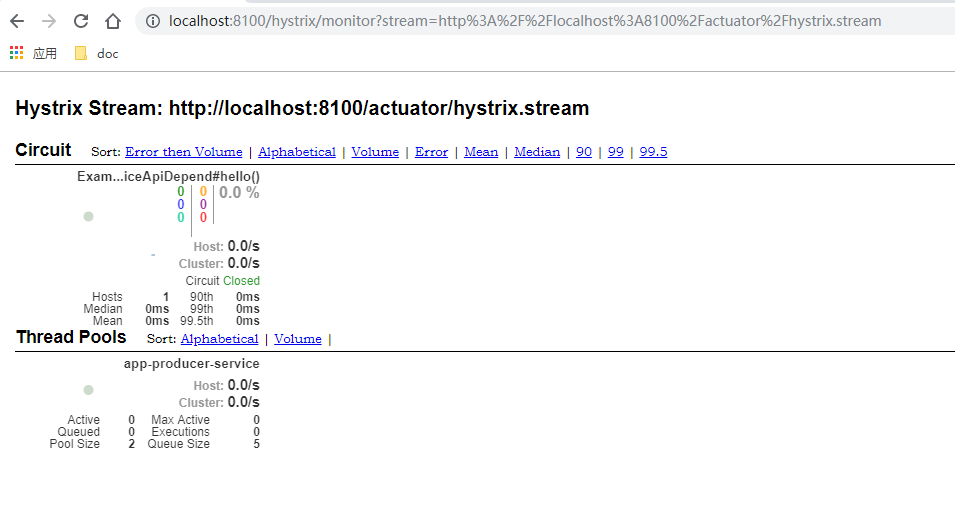

#   断路1：某个服务

##  效果

了解服务`断路`状态

这个的视角是服务消费者的角度

##  项目列表
-   cloud-eureka-service：治理服务，第一个启动
-   app-producer-service：服务提供者，其次启动
-   app-consumer-service：服务消费者，再次启动

spring cloud：
-   spring-cloud-starter-netflix-eureka-server：服务治理中心，提供服务发现、注册功能，是服务大管家
-   spring-cloud-starter-netflix-hystrix：服务降级、断路
-   spring-cloud-starter-openfeign：声明式服务调用，集成了 Ribbon(客户端侧负载均衡)，当服务提供者有多个实例或地址端口变动对客户端没有影响
-   spring-cloud-starter-netflix-eureka-client：服务治理客户端，把自己注册到服务治理，让其他服务调用
-   spring-boot-starter-actuator：发布服务状态信息
-   spring-cloud-starter-netflix-hystrix-dashboard：服务断路状态数据展示

##  访问

查看服务消费者状态信息，以及依赖的服务状态

-   与前面一样调用接口：`http://localhost:8100/helloConsumer`，得到的结果也一样
-   监控入口地址：`http://localhost:8100/hystrix`
    -   效果：
    -   执行1、2就可以看到图标显示了
    -   图标：，如果没有数据，就刷新一下调用接口

##  备注

可以看到单个服务断路的状态，当系统的服务很多时就需要聚合起来看了
