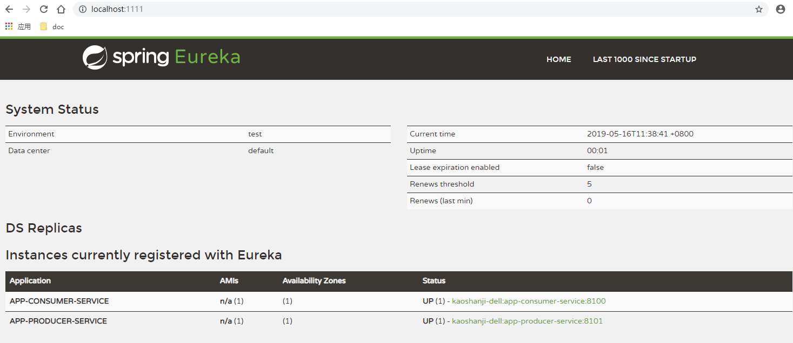
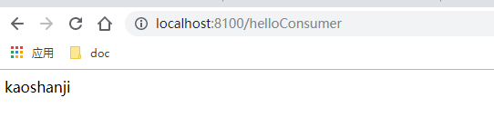

#   基础：服务中心和服务断路

##  效果

相互依赖的服务通过服务名称调用，并且在依赖异常时保证调用方正常

就像是电流过大保险闸自动断开，缩小影响范围

##  项目列表
-   cloud-eureka-service：治理服务，第一个启动
-   app-producer-service：服务提供者，其次启动
-   app-consumer-service：服务消费者，再次启动

spring cloud：
-   spring-cloud-starter-netflix-eureka-server：服务治理中心，提供服务发现、注册功能，是服务大管家
-   spring-cloud-starter-netflix-hystrix：服务降级、断路
-   spring-cloud-starter-openfeign：声明式服务调用，集成了 Ribbon(客户端侧负载均衡)，当服务提供者有多个实例或地址端口变动对客户端没有影响
-   spring-cloud-starter-netflix-eureka-client：服务治理客户端，把自己注册到服务治理，让其他服务调用

##  访问
-   治理服务
    -   地址：http://localhost:1111/
    -   效果：
-   消费者调用
    -   地址：http://localhost:8100/helloConsumer
    -   效果(正常)：
-   断路实现
    -   停掉提供者服务
    -   继续调用消费者：http://localhost:8100/helloConsumer
    -   效果(异常)：
    -   强刷清除缓存

##  备注
可以启动多个服务提供者实例，只是端口号不同，默认是轮询调用。

微服务里集成的方式之一：服务依赖，这是完成了，并且还不用URL那样绑定

但是，服务断路时信息还不知道，监控是一个很重要的方面，案发现场的信息都在这里。

