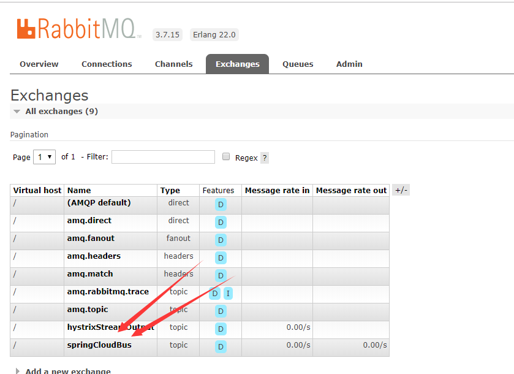
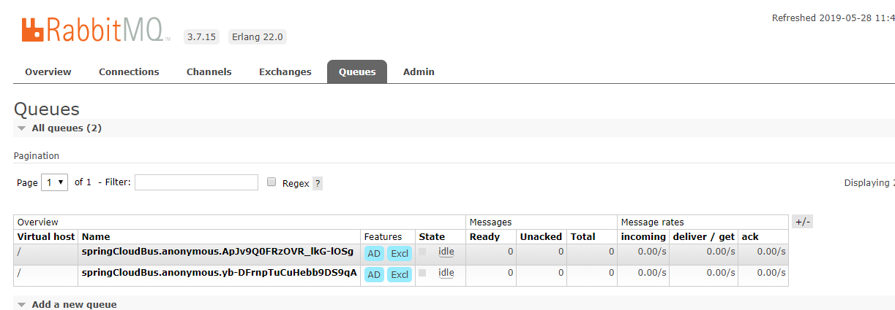

#   断路3：消息发布断路-turbine-RabbitMQ

##  效果

了解多个服务断路的状态，通过 RabbitMQ 发送信息

安装本地 RabbitMQ 服务器

/** 注释掉..
- 创建
  - 虚拟机： spring-turbine
  - 账户密码： springxp/springxp123456 ，并设置成 管理器
  - 权限：springxp 下 具有对 spring-turbine 全部权限
  **/

项目启动时会自动创建 交换器、队列等，可以注意观察 RabbitMQ 控制面板和IDEA控制台

查看 RabbitMQ
- 
- 

##  项目列表
-   cloud-eureka-service：治理服务，第一个启动
-   app-producer-service：服务提供者，其次启动
-   app-consumer-service：服务消费者，再次启动
-   app-hystrixCommand-service：演示方法级断路，再次启动
-   cloud-hystrix-turbine-service：聚合监控信息，再次启动

spring cloud：
- spring-cloud-starter-netflix-eureka-server：服务治理中心，提供服务发现、注册功能，是服务大管家
- spring-cloud-starter-netflix-hystrix：服务降级、断路
- spring-cloud-starter-openfeign：声明式服务调用，集成了 Ribbon(客户端侧负载均衡)，当服务提供者有多个实例或地址端口变动对客户端没有影响
- spring-cloud-starter-netflix-eureka-client：服务治理客户端，把自己注册到服务治理，让其他服务调用
- spring-boot-starter-actuator：发布服务状态信息
- spring-cloud-starter-netflix-hystrix-dashboard：服务断路状态数据展示
- spring-cloud-starter-netflix-turbine：整个系统断路监控
- spring-cloud-starter-netflix-turbine-stream：接收断路消息
- spring-cloud-netflix-hystrix-stream：发送断路消息
- spring-cloud-stream-binder-rabbit：集成 rabbit

##  访问

##  备注

