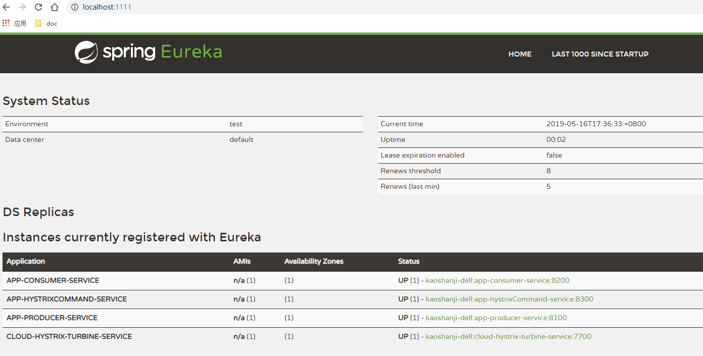
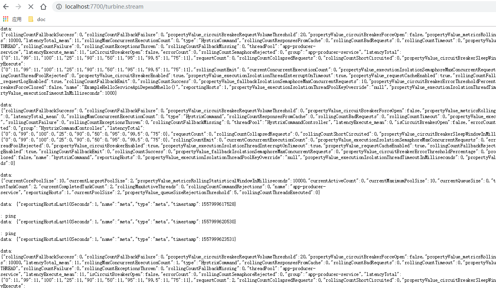
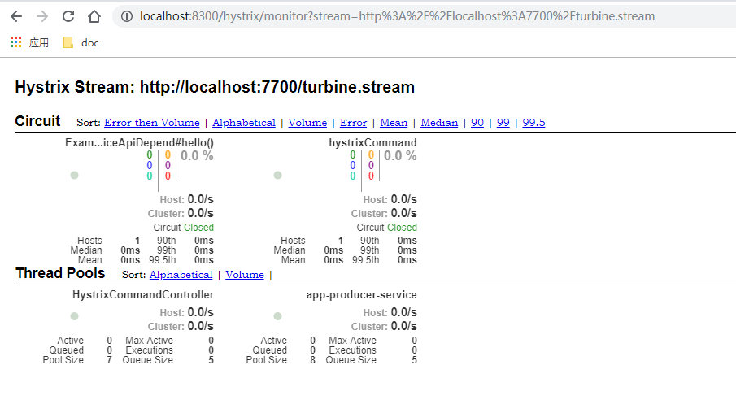

#   断路2：多个服务-turbine

##  效果

了解多个服务断路情况，把他们聚合起来显示

从系统整体的角度看看有那些保险闸

##  项目列表
-   cloud-eureka-service：治理服务，第一个启动
-   app-producer-service：服务提供者，其次启动
-   app-consumer-service：服务消费者，再次启动
-   app-hystrixCommand-service：演示方法级断路，再次启动
-   cloud-hystrix-turbine-service：聚合监控信息，再次启动

spring cloud：
-   spring-cloud-starter-netflix-eureka-server：服务治理中心，提供服务发现、注册功能，是服务大管家
-   spring-cloud-starter-netflix-hystrix：服务降级、断路
-   spring-cloud-starter-openfeign：声明式服务调用，集成了 Ribbon(客户端侧负载均衡)，当服务提供者有多个实例或地址端口变动对客户端没有影响
-   spring-cloud-starter-netflix-eureka-client：服务治理客户端，把自己注册到服务治理，让其他服务调用
-   spring-boot-starter-actuator：发布服务状态信息
-   spring-cloud-starter-netflix-hystrix-dashboard：服务断路状态数据展示
-   spring-cloud-starter-netflix-turbine：整个系统断路监控

##  访问

-   服务列表：http://localhost:1111/
    -   效果：
    -   上述几个服务都列出来了
-   断路接口
    -   http://localhost:8200/helloConsumer --> kaoshanji
    -   http://localhost:8300/hystrixCommand --> hystrixCommand
-   聚合数据：http://localhost:7700/turbine.stream
    -   在不停的加载数据
    -   效果：
-   图标显示
    -   地址：http://localhost:8300/hystrix
    -   输入：http://localhost:7700/turbine.stream
    -   效果：

##  备注

断路有两种，一个是方法级别，例如：app-hystrixCommand-service里HystrixCommandController，被`@HystrixCommand`修饰

一种是类级别，例如：app-consumer-service里ExampleHelloServiceApiDepend，被`@FeignClient`修饰

后者是对前者的包装

