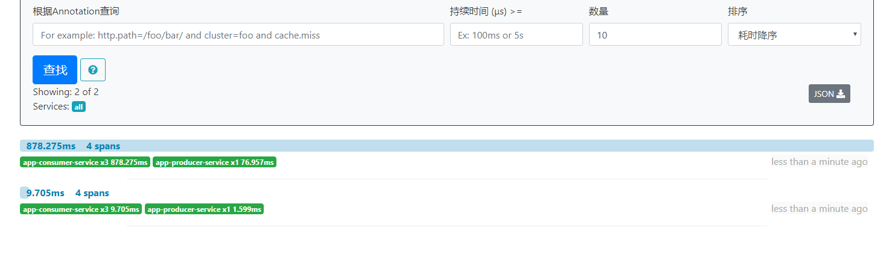

#   监控2：追踪服务调用过程-zipkin-MySQL-RabbitMQ


##  效果

查看服务调用过程的信息，通过 RabbitMQ 发送，MySQL 保存

需要先启动 RabbitMQ、并创建 MySql - zipkin数据库

````
# 设置 RabbitMQ 
java -jar zipkin.jar --zipkin.collector.rabbitmq.addresses=localhost

# 设置 RabbitMQ MySql
java -jar zipkin.jar --zipkin.collector.rabbitmq.addresses=localhost  --STORAGE_TYPE=mysql  --MYSQL_DB=zipkin  --MYSQL_USER=root  --MYSQL_PASS=Xande@123z456P;  --MYSQL_HOST=localhost  --MYSQL_TCP_PORT=3306

````

查看 RabbitMQ
- 

##  项目列表
-   zipkin 第一个启动：地址：http://127.0.0.1:9411/
    -   效果：
-   cloud-eureka-service：治理服务，第二个启动
-   app-producer-service：服务提供者，其次启动
-   app-consumer-service：服务消费者，再次启动

spring cloud：
-   spring-cloud-starter-sleuth：服务调用链路追踪
-   spring-cloud-starter-zipkin：集成zipkin，并展示追踪数据


##  访问
-   存在依赖调用的接口：http://localhost:8100/helloConsumer
-   刷新 9411 地址
    -   效果：


##  备注

源码：https://github.com/apache/incubator-zipkin --> 存储策略(zipkin-storage)，比如存到 mysql ，执行里面的 slq 语句。

zipkin、MySql 以及 sql 语句 需要兼容

