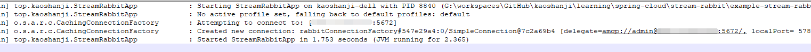
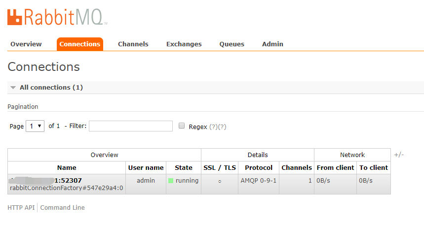
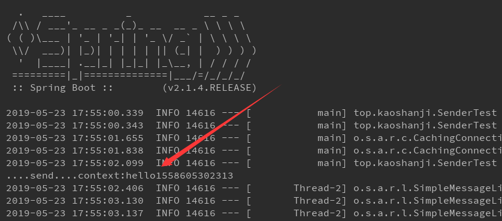
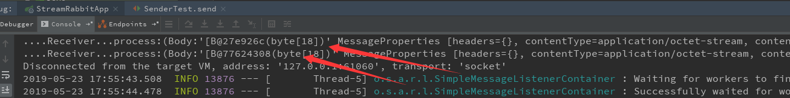

#   解耦应用：消息驱动-RabbitMQ

spring-boot 集成 RabbitMQ，演示消息发送与接收。

##  项目列表

阿里云服务器需要开放 15672、5672 端口

在 RabbitMQ 创建 `springcloud` 队列，其他默认

- stream-rabbit

也可以把发送消息和接收消息分割成不同的项目

##  访问

消息发送类型要与接收类型保存一致

根据交换器不同，对应的配置也有调整

启动 main 方法，控制台输出..

RabbitMQ 控制台，出现了连接数量

执行 测试方法：SenderTest

##  备注

微服务通信、集成方案之一：消息驱动，可以实现异步操作，解耦服务依赖

消息中间件是微服务里必不可少的服务，很多地方都需要

引入消息中间件也就新增了风险，这个要是挂了影响就大大的

