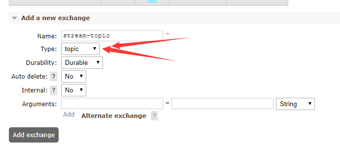
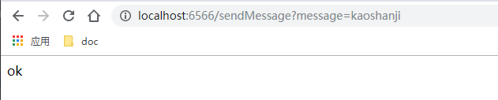
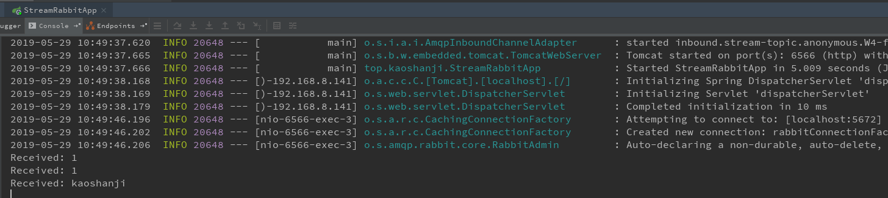
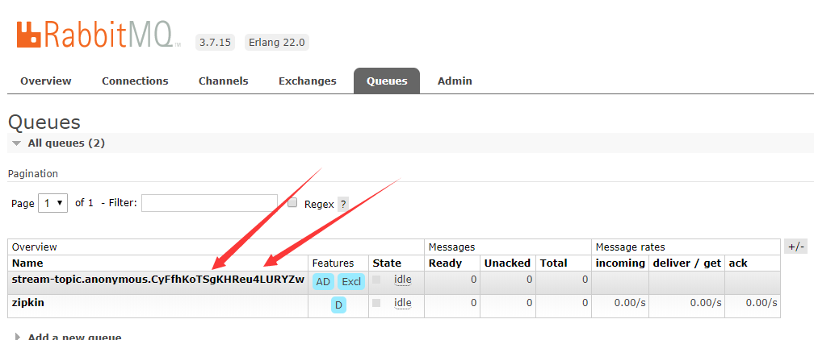

#   解耦应用：消息驱动-RabbitMQ

spring-cloud 集成 RabbitMQ，演示消息发送与接收。

##  项目列表

- stream-rabbit

消费自己生产的消息

- spring cloud ：
  - spring-cloud-stream-binder-rabbit：集成RabbitMQ

##  访问

进入 RabbitMQ 控制台：http://localhost:15672/  账户：guest/guest

创建交换器，也就是某种主题

启动应用，访问地址：http://localhost:6566/sendMessage?message=kaoshanji ，界面显示

看 IDEA、RabbitMQ 控制台

##  备注

微服务通信、集成方案之一：消息驱动，可以实现异步操作，解耦服务依赖

消息中间件是微服务里必不可少的服务，很多地方都需要

引入消息中间件也就新增了风险，这个要是挂了影响就大大的

