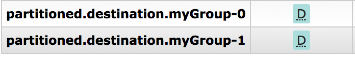

# 41. RabbitMQ Binder

## 41. RabbitMQ活页夹

## 41.1使用

要使用RabbitMQ绑定器，可以通过使用以下Maven坐标将其添加到Spring Cloud Stream应用程序中：

```xml
<dependency>
  <groupId>org.springframework.cloud</groupId>
  <artifactId>spring-cloud-stream-binder-rabbit</artifactId>
</dependency>
```

或者，您可以使用Spring Cloud Stream RabbitMQ Starter，如下所示：

```xml
<dependency>
  <groupId>org.springframework.cloud</groupId>
  <artifactId>spring-cloud-starter-stream-rabbit</artifactId>
</dependency>
```

## 41.2 RabbitMQ活页夹概述

以下简化图显示了RabbitMQ绑定程序的工作方式：


**图41.1。RabbitMQ活页夹**


默认情况下，RabbitMQ Binder实现将每个目标映射到`TopicExchange`。对于每个消费者组，a `Queue`都必须绑定到`TopicExchange`。每个使用者实例都有`Consumer`与其组对应的RabbitMQ 实例`Queue`。对于分区的生产者和使用者，队列带有分区索引后缀，并将分区索引用作路由键。对于匿名使用者（没有`group`属性的使用者），将使用自动删除队列（具有随机的唯一名称）。

通过使用可选`autoBindDlq`选项，您可以配置活页夹以创建和配置死信队列（DLQ）（以及死信交换`DLX`，以及路由基础结构）。默认情况下，死信队列具有目标名称，后跟`.dlq`。如果启用了重试（`maxAttempts > 1`），则在重试用尽后，失败的消息将传递到DLQ。如果禁用了重试（`maxAttempts = 1`），则应设置`requeueRejected`为`false`（默认值），以便将失败的消息路由到DLQ，而不是重新排队。另外，`republishToDlq`使绑定程序将失败的消息发布到DLQ（而不是拒绝它）。此功能可让其他信息（例如`x-exception-stacktrace`标头）添加到标头中的邮件中。此选项不需要启用重试。只需尝试一次，您就可以重新发布失败的消息。从1.2版开始，您可以配置重新发布邮件的传递模式。见[`republishDeliveryMode`物业](https://cloud.spring.io/spring-cloud-static/Greenwich.SR3/multi/multi__rabbitmq_binder.html#spring-cloud-stream-rabbit-republish-delivery-mode)。

| ![[重要]](https://cloud.spring.io/spring-cloud-static/Greenwich.SR3/multi/images/important.png) | 重要 |
| ------------------------------------------------------------ | ---- |
| 设置`requeueRejected`为`true`（with `republishToDlq=false`）将导致消息被重新排队并连续重新发送，除非失败的原因是短暂的，否则这可能不是您想要的。通常，应通过设置`maxAttempts`为大于1或将设置`republishToDlq`为来在活页夹中启用重试`true`。 |      |

有关这些属性的更多信息[，](https://cloud.spring.io/spring-cloud-static/Greenwich.SR3/multi/multi__rabbitmq_binder.html#rabbit-binder-properties)请参见[第41.3.1节“ RabbitMQ活页夹属性”](https://cloud.spring.io/spring-cloud-static/Greenwich.SR3/multi/multi__rabbitmq_binder.html#rabbit-binder-properties)。

该框架没有提供任何标准机制来使用死信消息（或将其重新路由回主队列）。[第41.6节“死信队列处理”](https://cloud.spring.io/spring-cloud-static/Greenwich.SR3/multi/multi__rabbitmq_binder.html#rabbit-dlq-processing)中介绍了一些选项。

| ![[注意]](https://cloud.spring.io/spring-cloud-static/Greenwich.SR3/multi/images/note.png) |
| ------------------------------------------------------------ |
| 在Spring Cloud Stream应用程序中使用多个RabbitMQ绑定程序时，重要的是禁用“ RabbitAutoConfiguration”，以避免将相同的配置`RabbitAutoConfiguration`应用于两个绑定程序。您可以使用`@SpringBootApplication`注释排除该类。 |

从2.0版开始，`RabbitMessageChannelBinder`将该`RabbitTemplate.userPublisherConnection`属性设置为，`true`以便非事务生产方避免对使用者造成死锁，如果由于代理上的[内存警报](https://www.rabbitmq.com/memory.html)而阻止了缓存的连接，则可能发生死锁。

| ![[注意]](https://cloud.spring.io/spring-cloud-static/Greenwich.SR3/multi/images/note.png) |
| ------------------------------------------------------------ |
| 当前，仅`multiplex`消费者（消息消费者正在听多个队列）仅受消息驱动的消费者使用。被轮询的使用者只能从单个队列中检索消息。 |

## 41.3配置选项

本节包含特定于RabbitMQ活页夹和绑定通道的设置。

有关常规绑定配置选项和属性，请参阅[Spring Cloud Stream核心文档](https://github.com/spring-cloud/spring-cloud-stream/blob/master/spring-cloud-stream-core-docs/src/main/asciidoc/spring-cloud-stream-overview.adoc#configuration-options)。

### 41.3.1 RabbitMQ活页夹属性

默认情况下，RabbitMQ绑定器使用Spring Boot的`ConnectionFactory`。一致地，它支持RabbitMQ的所有Spring Boot配置选项。（有关参考，请参阅[Spring Boot文档](https://docs.spring.io/spring-boot/docs/current/reference/htmlsingle/#common-application-properties)）。RabbitMQ配置选项使用`spring.rabbitmq`前缀。

除了Spring Boot选项之外，RabbitMQ绑定器还支持以下属性：

- spring.cloud.stream.rabbit.binder.adminAddresses

  以逗号分隔的RabbitMQ管理插件URL列表。仅在`nodes`包含多个条目时使用。此列表中的每个条目都必须在中具有一个对应的条目`spring.rabbitmq.addresses`。仅当您使用RabbitMQ集群并希望从托管队列的节点使用时才需要。有关更多信息，请参见[队列亲和力和LocalizedQueueConnectionFactory](https://docs.spring.io/spring-amqp/reference/html/_reference.html#queue-affinity)。默认值：空。

- spring.cloud.stream.rabbit.binder.nodes

  以逗号分隔的RabbitMQ节点名称列表。多个条目时，用于定位队列所在的服务器地址。此列表中的每个条目都必须在中具有一个对应的条目`spring.rabbitmq.addresses`。仅当您使用RabbitMQ集群并希望从托管队列的节点使用时才需要。有关更多信息，请参见[队列亲和力和LocalizedQueueConnectionFactory](https://docs.spring.io/spring-amqp/reference/html/_reference.html#queue-affinity)。默认值：空。

- spring.cloud.stream.rabbit.binder.compressionLevel

  压缩绑定的压缩级别。请参阅`java.util.zip.Deflater`。默认值：`1`（BEST_LEVEL）。

- spring.cloud.stream.binder.connection-name-prefix

  连接名称前缀，用于命名此绑定程序创建的连接。该名称是该前缀，后跟`#n`，`n`每次打开新连接时该名称都会递增。默认值：无（Spring AMQP默认值）。

### 41.3.2 RabbitMQ消费者属性

以下属性仅适用于Rabbit消费者，并且必须以开头`spring.cloud.stream.rabbit.bindings..consumer.`。

- 确认模式

  确认模式。默认值：`AUTO`。

- autoBindDlq

  是否自动声明DLQ并将其绑定到绑定器DLX。默认值：`false`。

- bindingRoutingKey

  用于将队列绑定到交换机的路由密钥（如果`bindQueue`为`true`）。对于分区的目标，`-`附加。默认值：`#`。

- bindQueue

  是否将队列绑定到目标交换机。`false`如果您已经设置了自己的基础结构并且先前已创建并绑定了队列，则将其设置为。默认值：`true`。

- ConsumerTagPrefix

  用于创建消费者标签；将被添加到为每个创建的消费者增加的`#n`位置`n`。范例：`${spring.application.name}-${spring.cloud.stream.bindings.input.group}-${spring.cloud.stream.instance-index}`。默认值：无-经纪人将生成随机的消费者标签。

- deadLetterQueueName

  DLQ的名称默认： `prefix+destination.dlq`

- deadLetterExchange

  分配给队列的DLX。仅当`autoBindDlq`是相关的`true`。默认值：“ prefix + DLX”

- deadLetterExchangeType

  分配给队列的DLX的类型。仅当`autoBindDlq`是相关的`true`。默认值：“直接”

- deadLetterRoutingKey

  分配给队列的死信路由键。仅当`autoBindDlq`是相关的`true`。默认： `destination`

- 声明Dlx

  是否声明目的地交换死信。仅当`autoBindDlq`是相关的`true`。`false`如果您具有预配置的DLX ，则设置为。默认值：`true`。

- 声明交换

  是否声明目的地交换。默认值：`true`。

- 延迟交易

  是否将交换声明为`Delayed Message Exchange`。在代理上需要延迟的消息交换插件。该`x-delayed-type`参数设置为`exchangeType`。默认值：`false`。

- dlqDeadLetterExchange

  如果声明了DLQ，则分配给该队列的DLX。默认： `none`

- dlqDeadLetterRoutingKey

  如果声明了DLQ，则分配给该队列的死信路由密钥。默认： `none`

- dlqExpires

  删除未使用的死信队列的时间（以毫秒为单位）。默认： `no expiration`

- dlqLazy

  用`x-queue-mode=lazy`参数声明死信队列。请参阅[“ 惰性队列 ”](https://www.rabbitmq.com/lazy-queues.html)。考虑使用策略而不是此设置，因为使用策略允许更改设置而不删除队列。默认值：`false`。

- dlqMaxLength

  死信队列中的最大消息数。默认： `no limit`

- dlqMaxLengthBytes

  所有消息中的死信队列中的最大总字节数。默认： `no limit`

- dlqMaxPriority

  死信队列中邮件的最大优先级（0-255）。默认： `none`

- dlqOverflow行为

  超过`dlqMaxLength`或时应采取的行动`dlqMaxLengthBytes`；当前`drop-head`还是`reject-publish`要参考RabbitMQ文档。默认： `none`

- dlqTtl

  声明时应用于死信队列的默认生存时间（以毫秒为单位）。默认： `no limit`

- 持久订阅

  订阅是否应持久。仅在`group`已设置的情况下有效。默认值：`true`。

- exchangeAutoDelete

  如果`declareExchange`为true，则是否应自动删除交换（即在删除最后一个队列之后将其删除）。默认值：`true`。

- 耐用

  如果`declareExchange`为true，则表示交换是否应该持久（即，在代理重新启动后仍然存在）。默认值：`true`。

- exchangeType

  交换类型：`direct`，`fanout`或者`topic`用于非分区目的地，`direct`或者`topic`用于分区目的地。默认值：`topic`。

- 独家

  是否创建独家消费者。当为时，并发应为1 `true`。通常在需要严格订购但使热备用实例在发生故障后接管时使用。请参阅`recoveryInterval`，它控制备用实例尝试使用的频率。默认值：`false`。

- 过期

  删除未使用的队列的时间（以毫秒为单位）。默认： `no expiration`

- failedDeclarationRetryInterval

  丢失队列时尝试消耗队列之间的时间间隔（以毫秒为单位）。默认值：5000

- headerPatterns

  从入站邮件映射标头的模式。默认值：（`['*']`所有标头）。

- 懒

  用`x-queue-mode=lazy`参数声明队列。请参阅[“ 惰性队列 ”](https://www.rabbitmq.com/lazy-queues.html)。考虑使用策略而不是此设置，因为使用策略允许更改设置而不删除队列。默认值：`false`。

- maxConcurrency

  最大消费者数。默认值：`1`。

- 最长长度

  队列中的最大消息数。默认： `no limit`

- maxLengthBytes

  来自所有消息的队列中的最大总字节数。默认： `no limit`

- maxPriority

  队列中消息的最大优先级（0-255）。默认： `none`

- missingQueuesFatal

  当找不到队列时，是否将条件视为致命并停止侦听器容器。默认值为，`false`以便容器继续尝试从队列中使用数据，例如，在使用群集且承载非HA队列的节点关闭时。默认： `false`

- 溢出行为

  超过`maxLength`或时应采取的行动`maxLengthBytes`；当前`drop-head`还是`reject-publish`要参考RabbitMQ文档。默认： `none`

- 预取

  预取计数。默认值：`1`。

- 字首

  要添加到`destination`和队列名称的前缀。默认值：“”。

- queueDeclarationRetries

  缺少队列时重试消耗的次数。有关只有当`missingQueuesFatal`是`true`。否则，容器将无限期地重试。默认： `3`

- queueNameGroupOnly

  为true时，从名称等于的队列中使用`group`。否则，队列名称为`destination.group`。例如，在使用Spring Cloud Stream从现有RabbitMQ队列中使用时，这很有用。默认值：false。

- recoveryInterval

  连接恢复尝试之间的时间间隔（以毫秒为单位）。默认值：`5000`。

- 重新排队

  当重试被关闭或是否发送故障应重新排队`republishToDlq`的`false`。默认值：`false`。


- republishDeliveryMode

  当`republishToDlq`为时`true`，指定重新发布消息的传递方式。默认： `DeliveryMode.PERSISTENT`

- republishToDlq

  默认情况下，拒绝重试后失败的消息将被拒绝。如果配置了死信队列（DLQ），RabbitMQ会将失败的消息（未更改）路由到DLQ。如果设置为`true`，则绑定程序将使用其他标头将失败的消息重新发布到DLQ，包括异常消息和来自最终失败原因的堆栈跟踪。默认值：false

- 交易的

  是否使用交易渠道。默认值：`false`。

- ttl

  声明时应用于队列的默认生存时间（以毫秒为单位）。默认： `no limit`

- txSize

  两次之间的分娩次数。默认值：`1`。

### 41.3.3高级侦听器容器配置

要设置未公开为绑定程序或绑定属性的侦听器容器属性，请将单个类型的bean添加`ListenerContainerCustomizer`到应用程序上下文中。将设置活页夹和绑定属性，然后将调用定制程序。定制器（`configure()`方法）提供了队列名称以及使用者组作为参数。

### 41.3.4兔生产者属性

以下属性仅适用于Rabbit生产者，并且必须带有前缀`spring.cloud.stream.rabbit.bindings..producer.`。

- autoBindDlq

  是否自动声明DLQ并将其绑定到绑定器DLX。默认值：`false`。

- batchingEnabled

  是否启用生产者的邮件批处理。消息根据以下属性（在此列表的后三个条目中进行描述）被批处理为一条消息：'batchSize' `batchBufferLimit`，和`batchTimeout`。有关更多信息，请参见[批处理](https://docs.spring.io/spring-amqp//reference/html/_reference.html#template-batching)。默认值：`false`。

- batchSize

  启用批处理时要缓冲的消息数。默认值：`100`。

- batchBufferLimit

  启用批处理时的最大缓冲区大小。默认值：`10000`。

- batchTimeout

  启用批处理时的批处理超时。默认值：`5000`。

- bindingRoutingKey

  用于将队列绑定到交换机的路由密钥（如果`bindQueue`为`true`）。仅适用于未分区的目的地。仅`requiredGroups`在提供的情况下适用，然后仅适用于那些组。默认值：`#`。

- bindQueue

  是否将队列绑定到目标交换机。`false`如果您已经设置了自己的基础结构并且先前已创建并绑定了队列，则将其设置为。仅`requiredGroups`在提供的情况下适用，然后仅适用于那些组。默认值：`true`。

- 压缩

  发送时是否应压缩数据。默认值：`false`。

- deadLetterQueueName

  DLQ的名称仅`requiredGroups`在提供时才适用，然后仅适用于那些组。默认： `prefix+destination.dlq`

- deadLetterExchange

  分配给队列的DLX。有关只有当`autoBindDlq`是`true`。仅在`requiredGroups`提供时才适用，然后仅适用于那些组。默认值：“ prefix + DLX”

- deadLetterExchangeType

  分配给队列的DLX的类型。仅当`autoBindDlq`是相关的`true`。仅在`requiredGroups`提供时才适用，然后仅适用于那些组。默认值：“直接”

- deadLetterRoutingKey

  分配给队列的死信路由键。有关只有当`autoBindDlq`是`true`。仅在`requiredGroups`提供时才适用，然后仅适用于那些组。默认： `destination`

- 声明Dlx

  是否声明目的地交换死信。仅当`autoBindDlq`是相关的`true`。`false`如果您具有预配置的DLX ，则设置为。仅在`requiredGroups`提供时才适用，然后仅适用于那些组。默认值：`true`。

- 声明交换

  是否声明目的地交换。默认值：`true`。

- delayExpression

  一个SpEL表达式，用于评估应用于消息（`x-delay`标头）的延迟。如果交换不是延迟的消息交换，则无效。默认值：`x-delay`未设置标题。

- 延迟交易

  是否将交换声明为`Delayed Message Exchange`。在代理上需要延迟的消息交换插件。该`x-delayed-type`参数设置为`exchangeType`。默认值：`false`。

- deliveryMode

  交付方式。默认值：`PERSISTENT`。

- dlqDeadLetterExchange

  声明DLQ后，将分配给该队列的DLX。仅在`requiredGroups`提供的情况下适用，然后仅在这些组中适用。默认： `none`

- dlqDeadLetterRoutingKey

  声明DLQ后，分配给该队列的死信路由密钥。仅在`requiredGroups`提供时才适用，然后仅适用于那些组。默认： `none`

- dlqExpires

  删除未使用的死信队列之前的时间（以毫秒为单位）。仅在`requiredGroups`提供时才适用，然后仅适用于那些组。默认： `no expiration`

- dlqLazy

  用`x-queue-mode=lazy`参数声明死信队列。请参阅[“ 惰性队列 ”](https://www.rabbitmq.com/lazy-queues.html)。考虑使用策略而不是此设置，因为使用策略允许更改设置而不删除队列。仅在`requiredGroups`提供时才适用，然后仅适用于那些组。

- dlqMaxLength

  死信队列中的最大消息数。仅在`requiredGroups`提供的情况下适用，然后仅在这些组中适用。默认： `no limit`

- dlqMaxLengthBytes

  所有消息中的死信队列中的最大总字节数。仅在`requiredGroups`提供时才适用，然后仅适用于那些组。默认： `no limit`

- dlqMaxPriority

  死信队列中邮件的最大优先级（0-255）仅在`requiredGroups`提供时才适用，然后仅适用于那些组。默认： `none`

- dlqTtl

  声明时应用于死信队列的默认生存时间（以毫秒为单位）。仅在`requiredGroups`提供时才适用，然后仅适用于那些组。默认： `no limit`

- exchangeAutoDelete

  如果`declareExchange`为`true`，则是否应该自动删除交换（在删除最后一个队列之后将其删除）。默认值：`true`。

- 耐用

  如果`declareExchange`为`true`，则交换是否应该持久（在代理重新启动后生存）。默认值：`true`。

- exchangeType

  交换类型：`direct`，`fanout`或者`topic`用于非分区目的地，`direct`或者`topic`用于分区目的地。默认值：`topic`。

- 过期

  删除未使用的队列之前的时间（以毫秒为单位）。仅在`requiredGroups`提供时才适用，然后仅适用于那些组。默认： `no expiration`

- headerPatterns

  标头要映射到出站邮件的模式。默认值：（`['*']`所有标头）。

- 懒

  用`x-queue-mode=lazy`参数声明队列。请参阅[“ 惰性队列 ”](https://www.rabbitmq.com/lazy-queues.html)。考虑使用策略而不是此设置，因为使用策略允许更改设置而不删除队列。仅在`requiredGroups`提供时才适用，然后仅适用于那些组。默认值：`false`。

- 最长长度

  队列中的最大消息数。仅在`requiredGroups`提供时才适用，然后仅适用于那些组。默认： `no limit`

- maxLengthBytes

  来自所有消息的队列中的最大总字节数。仅`requiredGroups`在提供的情况下适用，然后仅适用于那些组。默认： `no limit`

- maxPriority

  队列中消息的最大优先级（0-255）。仅`requiredGroups`在提供的情况下适用，然后仅适用于那些组。默认： `none`

- 字首

  要添加到`destination`交换名称的前缀。默认值：“”。

- queueNameGroupOnly

  何时`true`，从名称等于的队列中消费`group`。否则，队列名称为`destination.group`。例如，在使用Spring Cloud Stream从现有RabbitMQ队列中使用时，这很有用。仅在`requiredGroups`提供时才适用，然后仅适用于那些组。默认值：false。

- routingKeyExpression

  一个SpEL表达式，用于确定发布消息时要使用的路由密钥。对于固定的路由键，请使用文字表达式，例如`routingKeyExpression='my.routingKey'`在属性文件或`routingKeyExpression: '''my.routingKey'''`YAML文件中。默认值：`destination`或`destination-`用于分区目标。

- 交易的

  是否使用交易渠道。默认值：`false`。

- ttl

  声明时适用于队列的默认生存时间（以毫秒为单位）。仅在`requiredGroups`提供时才适用，然后仅适用于那些组。默认： `no limit`

| ![[注意]](https://cloud.spring.io/spring-cloud-static/Greenwich.SR3/multi/images/note.png) |
| ------------------------------------------------------------ |
| 对于RabbitMQ，可以由外部应用程序设置内容类型标头。Spring Cloud Stream支持它们作为扩展的内部协议的一部分，该协议用于任何类型的传输-包括诸如Kafka（0.11之前的版本）之类的传输器，这些传输器本身并不支持标头。 |

## 41.4使用RabbitMQ粘合剂重试

当在活页夹中启用重试时，侦听器容器线程将在配置的任何退避期间暂停。当需要单个消费者进行严格订购时，这可能很重要。但是，对于其他用例，它阻止在该线程上处理其他消息。使用活页夹重试的另一种方法是设置带有时间的无效字母，以使其驻留在无效字母队列（DLQ）中，并在DLQ本身上进行无效字母配置。有关此处讨论的属性的更多信息[，](https://cloud.spring.io/spring-cloud-static/Greenwich.SR3/multi/multi__rabbitmq_binder.html#rabbit-binder-properties)请参见“ [第41.3.1节“ RabbitMQ活页夹属性”](https://cloud.spring.io/spring-cloud-static/Greenwich.SR3/multi/multi__rabbitmq_binder.html#rabbit-binder-properties) ”。您可以使用以下示例配置来启用此功能：

- 设置`autoBindDlq`到`true`。活页夹创建一个DLQ。（可选）您可以在中指定名称`deadLetterQueueName`。
- 设置`dlqTtl`为您希望在重新交付之间等待的退避时间。
- 将设置`dlqDeadLetterExchange`为默认交换。来自DLQ的过期消息被路由到原始队列，因为默认`deadLetterRoutingKey`值为队列名称（`destination.group`）。设置为默认交换是通过将属性设置为无值来实现的，如下例所示。

要强制对消息进行死信处理，请抛出`AmqpRejectAndDontRequeueException`或设置`requeueRejected`为`true`（默认值）并抛出任何异常。

循环无休止地继续进行，这对于瞬态问题很好，但是您可能需要在尝试几次后放弃。幸运的是，RabbitMQ提供了`x-death`标头，可让您确定发生了多少个循环。

要在放弃后确认消息，请抛出`ImmediateAcknowledgeAmqpException`。

### 41.4.1整合在一起

以下配置创建一个`myDestination`带有队列的交换，该队列`myDestination.consumerGroup`与使用通配符路由键的主题交换绑定`#`：

```properties
---
spring.cloud.stream.bindings.input.destination=myDestination
spring.cloud.stream.bindings.input.group=consumerGroup
#disable binder retries
spring.cloud.stream.bindings.input.consumer.max-attempts=1
#dlx/dlq setup
spring.cloud.stream.rabbit.bindings.input.consumer.auto-bind-dlq=true
spring.cloud.stream.rabbit.bindings.input.consumer.dlq-ttl=5000
spring.cloud.stream.rabbit.bindings.input.consumer.dlq-dead-letter-exchange=
---
```

此配置会创建一个绑定到直接交换（`DLX`）的DLQ，且路由键为`myDestination.consumerGroup`。当邮件被拒绝时，它们将被路由到DLQ。5秒后，该消息到期，并通过使用队列名称作为路由键将其路由到原始队列，如以下示例所示：

**Spring Boot应用程序。** 

```java
@SpringBootApplication
@EnableBinding(Sink.class)
public class XDeathApplication {

    public static void main(String[] args) {
        SpringApplication.run(XDeathApplication.class, args);
    }

    @StreamListener(Sink.INPUT)
    public void listen(String in, @Header(name = "x-death", required = false) Map<?,?> death) {
        if (death != null && death.get("count").equals(3L)) {
            // giving up - don't send to DLX
            throw new ImmediateAcknowledgeAmqpException("Failed after 4 attempts");
        }
        throw new AmqpRejectAndDontRequeueException("failed");
    }

}
```


请注意，`x-death`标头中的count属性是一个`Long`。

## 41.5错误通道

从版本1.3开始，绑定程序无条件地将异常发送到每个使用者目标的错误通道，也可以将其配置为将异步生产者发送失败消息发送到错误通道。参见“ [??? ](https://cloud.spring.io/spring-cloud-static/Greenwich.SR3/multi/multi__rabbitmq_binder.html)”以获取更多信息。

RabbitMQ有两种类型的发送失败：

- 返回的消息，
- 负面认可的[出版商确认](https://www.rabbitmq.com/confirms.html)。

后者很少见。根据RabbitMQ文档，“ [仅在负责队列的Erlang进程中发生内部错误时，才会传递[nack]”。

除了启用生产者错误通道（如“ [???](https://cloud.spring.io/spring-cloud-static/Greenwich.SR3/multi/multi__rabbitmq_binder.html) ”中所述）外，RabbitMQ绑定器仅在正确配置连接工厂的情况下，才将消息发送到通道，如下所示：

- `ccf.setPublisherConfirms(true);`
- `ccf.setPublisherReturns(true);`

将Spring Boot配置用于连接工厂时，请设置以下属性：

- `spring.rabbitmq.publisher-confirms`
- `spring.rabbitmq.publisher-returns`

`ErrorMessage`返回消息的的有效负载为，`ReturnedAmqpMessageException`具有以下属性：

- `failedMessage`：`Message`未能发送的春季消息。
- `amqpMessage`：原始的spring-amqp `Message`。
- `replyCode`：表示失败原因的整数值（例如312-无路由）。
- `replyText`：表示失败原因的文本值（例如`NO_ROUTE`）。
- `exchange`：发布消息的交易所。
- `routingKey`：发布消息时使用的路由密钥。

对于否定确认的确认，有效载荷是`NackedAmqpMessageException`具有以下属性的：

- `failedMessage`：`Message`未能发送的春季消息。
- `nackReason`：原因（如果有的话，您可能需要检查代理日志以获取更多信息）。

没有对这些异常的自动处理（例如发送到[死信队列](https://cloud.spring.io/spring-cloud-static/Greenwich.SR3/multi/multi__rabbitmq_binder.html#rabbit-dlq-processing)）。您可以使用自己的Spring Integration流使用这些异常。

## 41.6死信队列处理

因为您无法预期用户将如何处置死信，所以该框架没有提供任何标准机制来处理它们。如果死信的原因是短暂的，则您可能希望将消息路由回原始队列。但是，如果问题是永久性问题，则可能导致无限循环。下面的Spring Boot应用程序显示了一个示例，该示例如何将这些消息路由回原始队列，但在尝试三次后将其移动到第三个“ 停车场 ”队列。第二个示例使用[RabbitMQ延迟消息交换](https://www.rabbitmq.com/blog/2015/04/16/scheduling-messages-with-rabbitmq/)为重新排队的消息引入延迟。在此示例中，每次尝试的延迟都会增加。这些示例使用`@RabbitListener`接收来自DLQ的消息。您也可以`RabbitTemplate.receive()`在批处理过程中使用。

这些示例假定原始目的地为`so8400in`，而消费者组为`so8400`。

### 41.6.1非分区目标

前两个示例适用于目标**未**分区的情况：

```java
@SpringBootApplication
public class ReRouteDlqApplication {

    private static final String ORIGINAL_QUEUE = "so8400in.so8400";

    private static final String DLQ = ORIGINAL_QUEUE + ".dlq";

    private static final String PARKING_LOT = ORIGINAL_QUEUE + ".parkingLot";

    private static final String X_RETRIES_HEADER = "x-retries";

    public static void main(String[] args) throws Exception {
        ConfigurableApplicationContext context = SpringApplication.run(ReRouteDlqApplication.class, args);
        System.out.println("Hit enter to terminate");
        System.in.read();
        context.close();
    }

    @Autowired
    private RabbitTemplate rabbitTemplate;

    @RabbitListener(queues = DLQ)
    public void rePublish(Message failedMessage) {
        Integer retriesHeader = (Integer) failedMessage.getMessageProperties().getHeaders().get(X_RETRIES_HEADER);
        if (retriesHeader == null) {
            retriesHeader = Integer.valueOf(0);
        }
        if (retriesHeader < 3) {
            failedMessage.getMessageProperties().getHeaders().put(X_RETRIES_HEADER, retriesHeader + 1);
            this.rabbitTemplate.send(ORIGINAL_QUEUE, failedMessage);
        }
        else {
            this.rabbitTemplate.send(PARKING_LOT, failedMessage);
        }
    }

    @Bean
    public Queue parkingLot() {
        return new Queue(PARKING_LOT);
    }

}

@SpringBootApplication
public class ReRouteDlqApplication {

    private static final String ORIGINAL_QUEUE = "so8400in.so8400";

    private static final String DLQ = ORIGINAL_QUEUE + ".dlq";

    private static final String PARKING_LOT = ORIGINAL_QUEUE + ".parkingLot";

    private static final String X_RETRIES_HEADER = "x-retries";

    private static final String DELAY_EXCHANGE = "dlqReRouter";

    public static void main(String[] args) throws Exception {
        ConfigurableApplicationContext context = SpringApplication.run(ReRouteDlqApplication.class, args);
        System.out.println("Hit enter to terminate");
        System.in.read();
        context.close();
    }

    @Autowired
    private RabbitTemplate rabbitTemplate;

    @RabbitListener(queues = DLQ)
    public void rePublish(Message failedMessage) {
        Map<String, Object> headers = failedMessage.getMessageProperties().getHeaders();
        Integer retriesHeader = (Integer) headers.get(X_RETRIES_HEADER);
        if (retriesHeader == null) {
            retriesHeader = Integer.valueOf(0);
        }
        if (retriesHeader < 3) {
            headers.put(X_RETRIES_HEADER, retriesHeader + 1);
            headers.put("x-delay", 5000 * retriesHeader);
            this.rabbitTemplate.send(DELAY_EXCHANGE, ORIGINAL_QUEUE, failedMessage);
        }
        else {
            this.rabbitTemplate.send(PARKING_LOT, failedMessage);
        }
    }

    @Bean
    public DirectExchange delayExchange() {
        DirectExchange exchange = new DirectExchange(DELAY_EXCHANGE);
        exchange.setDelayed(true);
        return exchange;
    }

    @Bean
    public Binding bindOriginalToDelay() {
        return BindingBuilder.bind(new Queue(ORIGINAL_QUEUE)).to(delayExchange()).with(ORIGINAL_QUEUE);
    }

    @Bean
    public Queue parkingLot() {
        return new Queue(PARKING_LOT);
    }

}
```

### 41.6.2分区目标

对于分区目标，所有分区都有一个DLQ。我们根据标题确定原始队列。

#### `republishToDlq=false`

当`republishToDlq`是`false`，RabbitMQ的发布消息到DLX / DLQ与`x-death`含有关于原始目的地信息头，如图以下示例：

```java
@SpringBootApplication
public class ReRouteDlqApplication {

	private static final String ORIGINAL_QUEUE = "so8400in.so8400";

	private static final String DLQ = ORIGINAL_QUEUE + ".dlq";

	private static final String PARKING_LOT = ORIGINAL_QUEUE + ".parkingLot";

	private static final String X_DEATH_HEADER = "x-death";

	private static final String X_RETRIES_HEADER = "x-retries";

	public static void main(String[] args) throws Exception {
		ConfigurableApplicationContext context = SpringApplication.run(ReRouteDlqApplication.class, args);
		System.out.println("Hit enter to terminate");
		System.in.read();
		context.close();
	}

	@Autowired
	private RabbitTemplate rabbitTemplate;

	@SuppressWarnings("unchecked")
	@RabbitListener(queues = DLQ)
	public void rePublish(Message failedMessage) {
		Map<String, Object> headers = failedMessage.getMessageProperties().getHeaders();
		Integer retriesHeader = (Integer) headers.get(X_RETRIES_HEADER);
		if (retriesHeader == null) {
			retriesHeader = Integer.valueOf(0);
		}
		if (retriesHeader < 3) {
			headers.put(X_RETRIES_HEADER, retriesHeader + 1);
			List<Map<String, ?>> xDeath = (List<Map<String, ?>>) headers.get(X_DEATH_HEADER);
			String exchange = (String) xDeath.get(0).get("exchange");
			List<String> routingKeys = (List<String>) xDeath.get(0).get("routing-keys");
			this.rabbitTemplate.send(exchange, routingKeys.get(0), failedMessage);
		}
		else {
			this.rabbitTemplate.send(PARKING_LOT, failedMessage);
		}
	}

	@Bean
	public Queue parkingLot() {
		return new Queue(PARKING_LOT);
	}

}
```

#### `republishToDlq=true`

当`republishToDlq`是`true`时，重新发布恢复器添加到报头中的原始交换和路由关键，因为显示在下面的例子：

```java
@SpringBootApplication
public class ReRouteDlqApplication {

	private static final String ORIGINAL_QUEUE = "so8400in.so8400";

	private static final String DLQ = ORIGINAL_QUEUE + ".dlq";

	private static final String PARKING_LOT = ORIGINAL_QUEUE + ".parkingLot";

	private static final String X_RETRIES_HEADER = "x-retries";

	private static final String X_ORIGINAL_EXCHANGE_HEADER = RepublishMessageRecoverer.X_ORIGINAL_EXCHANGE;

	private static final String X_ORIGINAL_ROUTING_KEY_HEADER = RepublishMessageRecoverer.X_ORIGINAL_ROUTING_KEY;

	public static void main(String[] args) throws Exception {
		ConfigurableApplicationContext context = SpringApplication.run(ReRouteDlqApplication.class, args);
		System.out.println("Hit enter to terminate");
		System.in.read();
		context.close();
	}

	@Autowired
	private RabbitTemplate rabbitTemplate;

	@RabbitListener(queues = DLQ)
	public void rePublish(Message failedMessage) {
		Map<String, Object> headers = failedMessage.getMessageProperties().getHeaders();
		Integer retriesHeader = (Integer) headers.get(X_RETRIES_HEADER);
		if (retriesHeader == null) {
			retriesHeader = Integer.valueOf(0);
		}
		if (retriesHeader < 3) {
			headers.put(X_RETRIES_HEADER, retriesHeader + 1);
			String exchange = (String) headers.get(X_ORIGINAL_EXCHANGE_HEADER);
			String originalRoutingKey = (String) headers.get(X_ORIGINAL_ROUTING_KEY_HEADER);
			this.rabbitTemplate.send(exchange, originalRoutingKey, failedMessage);
		}
		else {
			this.rabbitTemplate.send(PARKING_LOT, failedMessage);
		}
	}

	@Bean
	public Queue parkingLot() {
		return new Queue(PARKING_LOT);
	}

}
```

## 41.7使用RabbitMQ活页夹进行分区

RabbitMQ不支持本地分区。

有时，将数据发送到特定的分区是有好处的-例如，当您要严格订购消息处理时，特定客户的所有消息应转到同一分区。

在`RabbitMessageChannelBinder`提供通过结合一个队列为每个分区到目的地交换分隔。

以下Java和YAML示例显示了如何配置生产者：

**制片人。** 

```java
@SpringBootApplication
@EnableBinding(Source.class)
public class RabbitPartitionProducerApplication {

    private static final Random RANDOM = new Random(System.currentTimeMillis());

    private static final String[] data = new String[] {
            "abc1", "def1", "qux1",
            "abc2", "def2", "qux2",
            "abc3", "def3", "qux3",
            "abc4", "def4", "qux4",
            };

    public static void main(String[] args) {
        new SpringApplicationBuilder(RabbitPartitionProducerApplication.class)
            .web(false)
            .run(args);
    }

    @InboundChannelAdapter(channel = Source.OUTPUT, poller = @Poller(fixedRate = "5000"))
    public Message<?> generate() {
        String value = data[RANDOM.nextInt(data.length)];
        System.out.println("Sending: " + value);
        return MessageBuilder.withPayload(value)
                .setHeader("partitionKey", value)
                .build();
    }

}
```


**application.yml。** 

```properties
    spring:
      cloud:
        stream:
          bindings:
            output:
              destination: partitioned.destination
              producer:
                partitioned: true
                partition-key-expression: headers['partitionKey']
                partition-count: 2
                required-groups:
                - myGroup
```


| ![[注意]](https://cloud.spring.io/spring-cloud-static/Greenwich.SR3/multi/images/note.png) |
| ------------------------------------------------------------ |
| 前例中的配置使用默认分区（`key.hashCode() % partitionCount`）。根据键值，这可能会或可能不会提供适当的平衡算法。您可以使用`partitionSelectorExpression`或`partitionSelectorClass`属性覆盖此默认设置。`required-groups`仅当在部署生产者时需要供应使用者队列时，才需要该属性。否则，发送到分区的所有消息都将丢失，直到部署了相应的使用者为止。 |

以下配置提供了主题交换：


该交换绑定了以下队列：



以下绑定将队列与交换关联：


以下Java和YAML示例延续了前面的示例，并显示了如何配置使用者：

**消费者。** 

```java
@SpringBootApplication
@EnableBinding(Sink.class)
public class RabbitPartitionConsumerApplication {

    public static void main(String[] args) {
        new SpringApplicationBuilder(RabbitPartitionConsumerApplication.class)
            .web(false)
            .run(args);
    }

    @StreamListener(Sink.INPUT)
    public void listen(@Payload String in, @Header(AmqpHeaders.CONSUMER_QUEUE) String queue) {
        System.out.println(in + " received from queue " + queue);
    }

}
```


**application.yml。** 

```properties
    spring:
      cloud:
        stream:
          bindings:
            input:
              destination: partitioned.destination
              group: myGroup
              consumer:
                partitioned: true
                instance-index: 0
```


| ![[重要]](https://cloud.spring.io/spring-cloud-static/Greenwich.SR3/multi/images/important.png) | 重要 |
| ------------------------------------------------------------ | ---- |
| 在`RabbitMessageChannelBinder`不支持动态扩展。每个分区至少必须有一个使用方。使用者的`instanceIndex`用来指示使用哪个分区。诸如Cloud Foundry之类的平台只能具有一个实例`instanceIndex`。 |      |