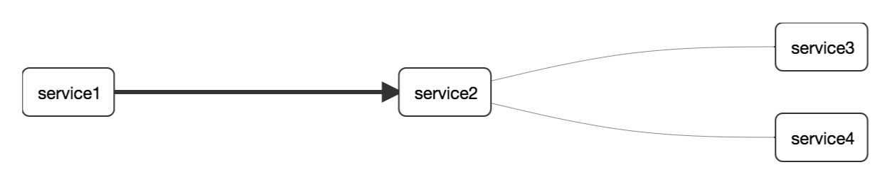

# 50. Introduction

## 50.引言

Spring Cloud Sleuth为[Spring Cloud](https://cloud.spring.io/)实现了分布式跟踪解决方案。

## 50.1术语

Spring Cloud Sleuth借鉴了[Dapper的](https://research.google.com/pubs/pub36356.html)术语。

**跨度**：基本工作单位。例如，发送RPC是一个新的跨度，就像发送响应到RPC一样。跨度由跨度的唯一64位ID和跨度所属的跟踪的另一个64位ID标识。跨区还具有其他数据，例如描述，带有时间戳的事件，键值注释（标签），引起跨度的跨区的ID和进程ID（通常为IP地址）。

跨度可以启动和停止，并且可以跟踪其时序信息。创建跨度后，您必须在将来的某个时间点将其停止。

| ![[小费]](https://cloud.spring.io/spring-cloud-static/Greenwich.SR3/multi/images/tip.png) |
| ------------------------------------------------------------ |
| 开始跟踪的初始跨度称为`root span`。该跨度的ID的值等于跟踪ID。 |

**迹线：**一组形成树状结构的跨度。例如，如果您运行分布式大数据存储，则跟踪可能是由`PUT`请求形成的。

**注释：**用于及时记录事件的存在。使用 [Brave](https://github.com/openzipkin/brave)工具，我们不再需要为[ Zipkin](https://zipkin.io/)设置特殊事件来了解客户端和服务器是谁，请求在哪里开始以及在哪里结束。但是，出于学习目的，我们标记这些事件以突出显示发生了哪种操作。

- **cs**：客户端已发送。客户提出了要求。此注释指示跨度的开始。
- **sr**：接收到服务器：服务器端收到了请求并开始处理它。`cs`从该时间戳中减去该时间戳可揭示网络延迟。
- **ss**：服务器已发送。在请求处理完成时进行注释（当响应被发送回客户端时）。`sr`从该时间戳中减去该时间戳将显示服务器端处理该请求所需的时间。
- **cr**：收到客户。表示跨度结束。客户端已成功收到服务器端的响应。`cs`从该时间戳中减去该时间戳将显示客户端从服务器接收响应所需的整个时间。

下图显示了**Span**和**Trace**以及Zipkin批注在系统中的外观：


音符的每种颜色表示一个跨度（有七个跨度-从**A**到**G**）。请考虑以下注意事项：

```properties
Trace Id = X
Span Id = D
Client Sent
```

该说明指出，当前跨距**跟踪编号**设定为**X**和**跨度标识**设置为**d**。此外，`Client Sent`事件发生了。

下图显示了跨度的父子关系：


## 50.2目的

以下各节引用上图中显示的示例。

### 50.2.1使用Zipkin进行分布式跟踪

本示例有七个跨度。如果转到Zipkin中的跟踪，则可以在第二个跟踪中看到此数字，如下图所示：


但是，如果选择特定的轨迹，则可以看到四个跨度，如下图所示：


| ![[注意]](https://cloud.spring.io/spring-cloud-static/Greenwich.SR3/multi/images/note.png) |
| ------------------------------------------------------------ |
| 选择特定轨迹时，会看到合并的跨度。这意味着，如果有两个跨度发送到Zipkin，且带有“服务器已接收和服务器已发送”或“客户端已接收和客户端已发送”注释，则它们将显示为单个跨度。 |

在这种情况下，为什么七个跨度和四个跨度有区别？

- 一个跨度来自`http:/start`跨度。它具有服务器已接收（`sr`）和服务器已发送（`ss`）批注。
- 两个跨度来自RPC调用从`service1`到`service2`到`http:/foo`端点。客户已发送（`cs`）和客户已接收（`cr`）事件在`service1`侧面发生。服务器已接收（`sr`）和服务器已发送（`ss`）事件在`service2`侧面发生。这两个跨度形成一个与RPC调用相关的逻辑跨度。
- 两个跨度来自RPC调用从`service2`到`service3`到`http:/bar`端点。客户已发送（`cs`）和客户已接收（`cr`）事件在`service2`侧面发生。服务器已接收（`sr`）和服务器已发送（`ss`）事件在`service3`侧面发生。这两个跨度形成一个与RPC调用相关的逻辑跨度。
- 两个跨度来自RPC调用从`service2`到`service4`到`http:/baz`端点。客户已发送（`cs`）和客户已接收（`cr`）事件在`service2`侧面发生。服务器已接收（`sr`）和服务器已发送（`ss`）事件在`service4`侧面发生。这两个跨度形成一个与RPC调用相关的逻辑跨度。

因此，如果我们计算物理范围，则有一个来自`http:/start`，两个来自`service1`调用`service2`，两个来自`service2` 调用`service3`，以及两个来自`service2`调用`service4`。总而言之，我们共有七个跨度。

从逻辑上讲，我们看到四个跨度的信息，因为我们有一个跨度与传入请求`service1`相关，而三个跨度与RPC调用相关。

### 50.2.2可视化错误

Zipkin使您可以可视化跟踪中的错误。当引发异常但未捕获到异常时，我们在跨度上设置了适当的标签，然后Zipkin可以正确着色。您可以在迹线列表中看到一条红色的迹线。之所以出现，是因为引发了异常。

如果单击该跟踪，将看到类似的图片，如下所示：


如果您再单击其中一个跨度，则会看到以下内容


跨度显示了错误的原因以及与之相关的整个堆栈跟踪。

### 50.2.3勇敢的分布式跟踪

从version开始`2.0.0`，Spring Cloud Sleuth使用[Brave](https://github.com/openzipkin/brave)作为跟踪库。因此，Sleuth不再负责存储上下文，而是将工作委托给Brave。

由于Sleuth与Brave具有不同的命名和标记约定，因此我们决定从现在开始遵循Brave的约定。但是，如果要使用传统的Sleuth方法，可以将`spring.sleuth.http.legacy.enabled`属性设置为`true`。

### 50.2.4现场示例


**图50.1。单击“ Pivotal Web服务”图标可实时观看！**


[点击此处观看直播！](https://docssleuth-zipkin-server.cfapps.io/)

Zipkin中的依赖关系图应类似于下图：




**图50.2。单击“ Pivotal Web服务”图标可实时观看！**


[点击此处观看直播！](https://docssleuth-zipkin-server.cfapps.io/dependency)

### 50.2.5日志关联

当使用grep通过扫描等于（例如）的跟踪ID来读取这四个应用程序的日志时`2485ec27856c56f4`，您将获得类似于以下内容的输出：

```bash
service1.log:2016-02-26 11:15:47.561  INFO [service1,2485ec27856c56f4,2485ec27856c56f4,true] 68058 --- [nio-8081-exec-1] i.s.c.sleuth.docs.service1.Application   : Hello from service1. Calling service2
service2.log:2016-02-26 11:15:47.710  INFO [service2,2485ec27856c56f4,9aa10ee6fbde75fa,true] 68059 --- [nio-8082-exec-1] i.s.c.sleuth.docs.service2.Application   : Hello from service2. Calling service3 and then service4
service3.log:2016-02-26 11:15:47.895  INFO [service3,2485ec27856c56f4,1210be13194bfe5,true] 68060 --- [nio-8083-exec-1] i.s.c.sleuth.docs.service3.Application   : Hello from service3
service2.log:2016-02-26 11:15:47.924  INFO [service2,2485ec27856c56f4,9aa10ee6fbde75fa,true] 68059 --- [nio-8082-exec-1] i.s.c.sleuth.docs.service2.Application   : Got response from service3 [Hello from service3]
service4.log:2016-02-26 11:15:48.134  INFO [service4,2485ec27856c56f4,1b1845262ffba49d,true] 68061 --- [nio-8084-exec-1] i.s.c.sleuth.docs.service4.Application   : Hello from service4
service2.log:2016-02-26 11:15:48.156  INFO [service2,2485ec27856c56f4,9aa10ee6fbde75fa,true] 68059 --- [nio-8082-exec-1] i.s.c.sleuth.docs.service2.Application   : Got response from service4 [Hello from service4]
service1.log:2016-02-26 11:15:48.182  INFO [service1,2485ec27856c56f4,2485ec27856c56f4,true] 68058 --- [nio-8081-exec-1] i.s.c.sleuth.docs.service1.Application   : Got response from service2 [Hello from service2, response from service3 [Hello from service3] and from service4 [Hello from service4]]
```

如果您使用日志汇总工具（例如[Kibana](https://www.elastic.co/products/kibana)，[Splunk](https://www.splunk.com/)和其他工具），则可以对发生的事件进行排序。来自Kibana的示例类似于下图：


如果要使用[Logstash](https://www.elastic.co/guide/en/logstash/current/index.html)，以下清单显示了Logstash的Grok模式：

```json
filter {
       # pattern matching logback pattern
       grok {
              match => { "message" => "%{TIMESTAMP_ISO8601:timestamp}\s+%{LOGLEVEL:severity}\s+\[%{DATA:service},%{DATA:trace},%{DATA:span},%{DATA:exportable}\]\s+%{DATA:pid}\s+---\s+\[%{DATA:thread}\]\s+%{DATA:class}\s+:\s+%{GREEDYDATA:rest}" }
       }
}
```

| ![[注意]](https://cloud.spring.io/spring-cloud-static/Greenwich.SR3/multi/images/note.png) |
| ------------------------------------------------------------ |
| 如果要将Grok与Cloud Foundry的日志一起使用，则必须使用以下模式： |

```json
filter {
       # pattern matching logback pattern
       grok {
              match => { "message" => "(?m)OUT\s+%{TIMESTAMP_ISO8601:timestamp}\s+%{LOGLEVEL:severity}\s+\[%{DATA:service},%{DATA:trace},%{DATA:span},%{DATA:exportable}\]\s+%{DATA:pid}\s+---\s+\[%{DATA:thread}\]\s+%{DATA:class}\s+:\s+%{GREEDYDATA:rest}" }
       }
}
```

#### 使用Logstash进行JSON Logback

通常，您不想将日志存储在文本文件中，而是存储在Logstash可以立即选择的JSON文件中。为此，您必须执行以下操作（出于可读性考虑，我们将依赖项传递为`groupId:artifactId:version`表示法）。

**依赖关系设置**

1. 确保Logback位于类路径（`ch.qos.logback:logback-core`）上。
2. 添加Logstash Logback编码。例如，要使用version `4.6`，请添加`net.logstash.logback:logstash-logback-encoder:4.6`。

**登录设置**

考虑以下Logback配置文件示例（名为[logback-spring.xml](https://github.com/spring-cloud-samples/sleuth-documentation-apps/blob/master/service1/src/main/resources/logback-spring.xml)）。

```xml
<?xml version="1.0" encoding="UTF-8"?>
<configuration>
	<include resource="org/springframework/boot/logging/logback/defaults.xml"/>
	​
	<springProperty scope="context" name="springAppName" source="spring.application.name"/>
	<!-- Example for logging into the build folder of your project -->
	<property name="LOG_FILE" value="${BUILD_FOLDER:-build}/${springAppName}"/>​

	<!-- You can override this to have a custom pattern -->
	<property name="CONSOLE_LOG_PATTERN"
			  value="%clr(%d{yyyy-MM-dd HH:mm:ss.SSS}){faint} %clr(${LOG_LEVEL_PATTERN:-%5p}) %clr(${PID:- }){magenta} %clr(---){faint} %clr([%15.15t]){faint} %clr(%-40.40logger{39}){cyan} %clr(:){faint} %m%n${LOG_EXCEPTION_CONVERSION_WORD:-%wEx}"/>

	<!-- Appender to log to console -->
	<appender name="console" class="ch.qos.logback.core.ConsoleAppender">
		<filter class="ch.qos.logback.classic.filter.ThresholdFilter">
			<!-- Minimum logging level to be presented in the console logs-->
			<level>DEBUG</level>
		</filter>
		<encoder>
			<pattern>${CONSOLE_LOG_PATTERN}</pattern>
			<charset>utf8</charset>
		</encoder>
	</appender>

	<!-- Appender to log to file -->​
	<appender name="flatfile" class="ch.qos.logback.core.rolling.RollingFileAppender">
		<file>${LOG_FILE}</file>
		<rollingPolicy class="ch.qos.logback.core.rolling.TimeBasedRollingPolicy">
			<fileNamePattern>${LOG_FILE}.%d{yyyy-MM-dd}.gz</fileNamePattern>
			<maxHistory>7</maxHistory>
		</rollingPolicy>
		<encoder>
			<pattern>${CONSOLE_LOG_PATTERN}</pattern>
			<charset>utf8</charset>
		</encoder>
	</appender>
	​
	<!-- Appender to log to file in a JSON format -->
	<appender name="logstash" class="ch.qos.logback.core.rolling.RollingFileAppender">
		<file>${LOG_FILE}.json</file>
		<rollingPolicy class="ch.qos.logback.core.rolling.TimeBasedRollingPolicy">
			<fileNamePattern>${LOG_FILE}.json.%d{yyyy-MM-dd}.gz</fileNamePattern>
			<maxHistory>7</maxHistory>
		</rollingPolicy>
		<encoder class="net.logstash.logback.encoder.LoggingEventCompositeJsonEncoder">
			<providers>
				<timestamp>
					<timeZone>UTC</timeZone>
				</timestamp>
				<pattern>
					<pattern>
						{
						"severity": "%level",
						"service": "${springAppName:-}",
						"trace": "%X{X-B3-TraceId:-}",
						"span": "%X{X-B3-SpanId:-}",
						"parent": "%X{X-B3-ParentSpanId:-}",
						"exportable": "%X{X-Span-Export:-}",
						"pid": "${PID:-}",
						"thread": "%thread",
						"class": "%logger{40}",
						"rest": "%message"
						}
					</pattern>
				</pattern>
			</providers>
		</encoder>
	</appender>
	​
	<root level="INFO">
		<appender-ref ref="console"/>
		<!-- uncomment this to have also JSON logs -->
		<!--<appender-ref ref="logstash"/>-->
		<!--<appender-ref ref="flatfile"/>-->
	</root>
</configuration>
```

该Logback配置文件：

- 将应用程序中的信息以JSON格式记录到`build/${spring.application.name}.json`文件中。
- 注释了两个附加的附加程序：控制台和标准日志文件。
- 具有与上一部分相同的日志记录模式。

| ![[注意]](https://cloud.spring.io/spring-cloud-static/Greenwich.SR3/multi/images/note.png) |
| ------------------------------------------------------------ |
| 如果您使用自定义`logback-spring.xml`，你必须通过`spring.application.name`的`bootstrap`，而不是`application`属性文件。否则，您的自定义登录文件将无法正确读取该属性。 |

### 50.2.6传播跨度上下文

跨度上下文是必须跨进程边界传播到任何子跨度的状态。跨度上下文的一部分是行李。跟踪和跨度ID是跨度上下文的必需部分。行李是可选部件。

行李是存储在span上下文中的一组key：value对。行李与踪迹一起旅行，并附着在每个跨度上。Spring Cloud Sleuth理解，如果HTTP标头以`baggage-`开头，并且对于消息传递，它以开头，则标头与行李相关`baggage_`。

| ![[重要]](https://cloud.spring.io/spring-cloud-static/Greenwich.SR3/multi/images/important.png) | 重要 |
| ------------------------------------------------------------ | ---- |
| 当前对行李物品的数量或大小没有限制。但是，请记住，太多会降低系统吞吐量或增加RPC延迟。在极端情况下，由于超出传输级别的消息或标头容量，过多的行李可能会使应用程序崩溃。 |      |

以下示例显示跨度设置行李：

```java
Span initialSpan = this.tracer.nextSpan().name("span").start();
ExtraFieldPropagation.set(initialSpan.context(), "foo", "bar");
ExtraFieldPropagation.set(initialSpan.context(), "UPPER_CASE", "someValue");
```

#### 行李与跨度标签

行李随身携带（每个孩子跨度都包含其父母的行李）。Zipkin不了解行李，也不会收到该信息。

| ![[重要]](https://cloud.spring.io/spring-cloud-static/Greenwich.SR3/multi/images/important.png) | 重要 |
| ------------------------------------------------------------ | ---- |
| 从Sleuth 2.0.0开始，您必须在项目配置中显式传递行李密钥名称。[在此处](https://cloud.spring.io/spring-cloud-static/Greenwich.SR3/multi/multi__propagation.html#prefixed-fields)阅读有关该设置的更多信息 |      |

标签被附加到特定范围。换句话说，它们仅针对该特定跨度显示。但是，您可以按标签搜索以找到轨迹，前提是存在一个具有所搜索标签值的跨度。

如果您希望能够基于行李查找跨度，则应在根跨度中添加相应的条目作为标签。

| ![[重要]](https://cloud.spring.io/spring-cloud-static/Greenwich.SR3/multi/images/important.png) | 重要 |
| ------------------------------------------------------------ | ---- |
| 范围必须在范围内。                                           |      |

以下清单显示了使用行李的集成测试：

**设置。** 

```properties
spring.sleuth:
  baggage-keys:
    - baz
    - bizarrecase
  propagation-keys:
    - foo
    - upper_case
```


**编码。** 

```java
initialSpan.tag("foo",
		ExtraFieldPropagation.get(initialSpan.context(), "foo"));
initialSpan.tag("UPPER_CASE",
		ExtraFieldPropagation.get(initialSpan.context(), "UPPER_CASE"));
```


## 50.3在项目中添加侦探

本节介绍如何使用Maven或Gradle将Sleuth添加到项目中。

| ![[重要]](https://cloud.spring.io/spring-cloud-static/Greenwich.SR3/multi/images/important.png) | 重要 |
| ------------------------------------------------------------ | ---- |
| 为确保您的应用程序名称正确显示在Zipkin中，请在中设置`spring.application.name`属性`bootstrap.yml`。 |      |

### 50.3.1仅侦探（对数关联）

如果您只想使用Spring Cloud Sleuth而没有Zipkin集成，则将该`spring-cloud-starter-sleuth`模块添加到您的项目中。

下面的示例演示如何使用Maven添加Sleuth：

**Maven。** 

```xml
<dependencyManagement> 1
      <dependencies>
          <dependency>
              <groupId>org.springframework.cloud</groupId>
              <artifactId>spring-cloud-dependencies</artifactId>
              <version>${release.train.version}</version>
              <type>pom</type>
              <scope>import</scope>
          </dependency>
      </dependencies>
</dependencyManagement>

<dependency> 2
    <groupId>org.springframework.cloud</groupId>
    <artifactId>spring-cloud-starter-sleuth</artifactId>
</dependency>
```


| [](https://cloud.spring.io/spring-cloud-static/Greenwich.SR3/multi/multi__introduction.html#CO1-1) | 我们建议您通过Spring BOM添加依赖项管理，这样就不必自己管理版本。 |
| ------------------------------------------------------------ | ------------------------------------------------------------ |
| [](https://cloud.spring.io/spring-cloud-static/Greenwich.SR3/multi/multi__introduction.html#CO1-2) | 将依赖项添加到`spring-cloud-starter-sleuth`。                |

下面的示例演示如何使用Gradle添加Sleuth：

**摇篮。** 

```json
dependencyManagement { 1
    imports {
        mavenBom "org.springframework.cloud:spring-cloud-dependencies:${releaseTrainVersion}"
    }
}

dependencies { 2
    compile "org.springframework.cloud:spring-cloud-starter-sleuth"
}
```


| [](https://cloud.spring.io/spring-cloud-static/Greenwich.SR3/multi/multi__introduction.html#CO2-1) | 我们建议您通过Spring BOM添加依赖项管理，这样就不必自己管理版本。 |
| ------------------------------------------------------------ | ------------------------------------------------------------ |
| [](https://cloud.spring.io/spring-cloud-static/Greenwich.SR3/multi/multi__introduction.html#CO2-2) | 将依赖项添加到`spring-cloud-starter-sleuth`。                |

### 50.3.2通过HTTP与Zipkin一起侦探

如果您同时需要Sleuth和Zipkin，请添加`spring-cloud-starter-zipkin`依赖项。

以下示例显示了如何对Maven执行此操作：

**Maven。** 

```xml
<dependencyManagement> 1
      <dependencies>
          <dependency>
              <groupId>org.springframework.cloud</groupId>
              <artifactId>spring-cloud-dependencies</artifactId>
              <version>${release.train.version}</version>
              <type>pom</type>
              <scope>import</scope>
          </dependency>
      </dependencies>
</dependencyManagement>

<dependency> 2
    <groupId>org.springframework.cloud</groupId>
    <artifactId>spring-cloud-starter-zipkin</artifactId>
</dependency>
```


| [](https://cloud.spring.io/spring-cloud-static/Greenwich.SR3/multi/multi__introduction.html#CO3-1) | 我们建议您通过Spring BOM添加依赖项管理，这样就不必自己管理版本。 |
| ------------------------------------------------------------ | ------------------------------------------------------------ |
| [](https://cloud.spring.io/spring-cloud-static/Greenwich.SR3/multi/multi__introduction.html#CO3-2) | 将依赖项添加到`spring-cloud-starter-zipkin`。                |

以下示例显示了如何对Gradle进行操作：

**摇篮。** 

```json
dependencyManagement { 1
    imports {
        mavenBom "org.springframework.cloud:spring-cloud-dependencies:${releaseTrainVersion}"
    }
}

dependencies { 2
    compile "org.springframework.cloud:spring-cloud-starter-zipkin"
}
```


| [](https://cloud.spring.io/spring-cloud-static/Greenwich.SR3/multi/multi__introduction.html#CO4-1) | 我们建议您通过Spring BOM添加依赖项管理，这样就不必自己管理版本。 |
| ------------------------------------------------------------ | ------------------------------------------------------------ |
| [](https://cloud.spring.io/spring-cloud-static/Greenwich.SR3/multi/multi__introduction.html#CO4-2) | 将依赖项添加到`spring-cloud-starter-zipkin`。                |

### 50.3.3通过RabbitMQ或Kafka用Zipkin侦探

如果要使用RabbitMQ或Kafka而不是HTTP，请添加`spring-rabbit`或`spring-kafka`依赖项。默认目标名称为`zipkin`。

如果使用Kafka，则必须相应地设置property `spring.zipkin.sender.type`属性：

```properties
spring.zipkin.sender.type: kafka
```

| ![[警告]](https://cloud.spring.io/spring-cloud-static/Greenwich.SR3/multi/images/caution.png) | 警告 |
| ------------------------------------------------------------ | ---- |
| `spring-cloud-sleuth-stream` 已不推荐使用，并且与这些目的地不兼容。 |      |

如果要让Sleuth优于RabbitMQ，请添加`spring-cloud-starter-zipkin`和`spring-rabbit` 依赖项。

以下示例显示了如何对Gradle进行操作：

**Maven。** 

```xml
<dependencyManagement> 1
      <dependencies>
          <dependency>
              <groupId>org.springframework.cloud</groupId>
              <artifactId>spring-cloud-dependencies</artifactId>
              <version>${release.train.version}</version>
              <type>pom</type>
              <scope>import</scope>
          </dependency>
      </dependencies>
</dependencyManagement>

<dependency> 2
    <groupId>org.springframework.cloud</groupId>
    <artifactId>spring-cloud-starter-zipkin</artifactId>
</dependency>
<dependency> 3
    <groupId>org.springframework.amqp</groupId>
    <artifactId>spring-rabbit</artifactId>
</dependency>
```


| [](https://cloud.spring.io/spring-cloud-static/Greenwich.SR3/multi/multi__introduction.html#CO5-1) | 我们建议您通过Spring BOM添加依赖项管理，这样就不必自己管理版本。 |
| ------------------------------------------------------------ | ------------------------------------------------------------ |
| [](https://cloud.spring.io/spring-cloud-static/Greenwich.SR3/multi/multi__introduction.html#CO5-2) | 将依赖项添加到`spring-cloud-starter-zipkin`。这样，所有嵌套的依赖项都将被下载。 |
| [](https://cloud.spring.io/spring-cloud-static/Greenwich.SR3/multi/multi__introduction.html#CO5-3) | 要自动配置RabbitMQ，请添加`spring-rabbit`依赖项。            |

**摇篮。** 

```json
dependencyManagement { 1
    imports {
        mavenBom "org.springframework.cloud:spring-cloud-dependencies:${releaseTrainVersion}"
    }
}

dependencies {
    compile "org.springframework.cloud:spring-cloud-starter-zipkin" 2
    compile "org.springframework.amqp:spring-rabbit" 3
}
```


| [](https://cloud.spring.io/spring-cloud-static/Greenwich.SR3/multi/multi__introduction.html#CO6-1) | 我们建议您通过Spring BOM添加依赖项管理，这样就不必自己管理版本。 |
| ------------------------------------------------------------ | ------------------------------------------------------------ |
| [](https://cloud.spring.io/spring-cloud-static/Greenwich.SR3/multi/multi__introduction.html#CO6-2) | 将依赖项添加到`spring-cloud-starter-zipkin`。这样，所有嵌套的依赖项都将被下载。 |
| [](https://cloud.spring.io/spring-cloud-static/Greenwich.SR3/multi/multi__introduction.html#CO6-3) | 要自动配置RabbitMQ，请添加`spring-rabbit`依赖项。            |

## 50.4覆盖Zipkin的自动配置

从2.1.0版开始，Spring Cloud Sleuth支持将跟踪发送到多个跟踪系统。为了使它起作用，每个跟踪系统都需要有一个`Reporter`和`Sender`。如果要覆盖提供的bean，则需要给它们指定一个特定的名称。为此，您可以分别使用`ZipkinAutoConfiguration.REPORTER_BEAN_NAME`和`ZipkinAutoConfiguration.SENDER_BEAN_NAME`。

```java
@Configuration
protected static class MyConfig {

	@Bean(ZipkinAutoConfiguration.REPORTER_BEAN_NAME)
	Reporter<zipkin2.Span> myReporter() {
		return AsyncReporter.create(mySender());
	}

	@Bean(ZipkinAutoConfiguration.SENDER_BEAN_NAME)
	MySender mySender() {
		return new MySender();
	}

	static class MySender extends Sender {

		private boolean spanSent = false;

		boolean isSpanSent() {
			return this.spanSent;
		}

		@Override
		public Encoding encoding() {
			return Encoding.JSON;
		}

		@Override
		public int messageMaxBytes() {
			return Integer.MAX_VALUE;
		}

		@Override
		public int messageSizeInBytes(List<byte[]> encodedSpans) {
			return encoding().listSizeInBytes(encodedSpans);
		}

		@Override
		public Call<Void> sendSpans(List<byte[]> encodedSpans) {
			this.spanSent = true;
			return Call.create(null);
		}

	}

}
```