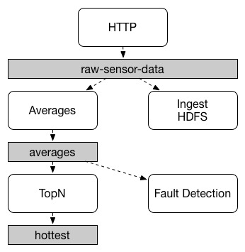
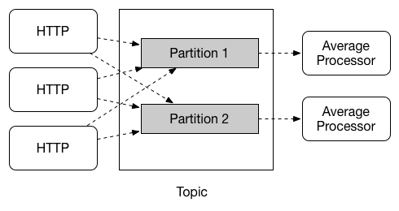

# 28. Main Concepts

## 28.主要概念

Spring Cloud Stream提供了许多抽象和原语，简化了消息驱动的微服务应用程序的编写。本节概述了以下内容：

- [Spring Cloud Stream的应用程序模型](https://cloud.spring.io/spring-cloud-static/Greenwich.SR3/multi/multi__main_concepts.html#spring-cloud-stream-overview-application-model)
- [第28.2节“活页夹抽象”](https://cloud.spring.io/spring-cloud-static/Greenwich.SR3/multi/multi__main_concepts.html#spring-cloud-stream-overview-binder-abstraction)
- [持久的发布-订阅支持](https://cloud.spring.io/spring-cloud-static/Greenwich.SR3/multi/multi__main_concepts.html#spring-cloud-stream-overview-persistent-publish-subscribe-support)
- [消费者群体支持](https://cloud.spring.io/spring-cloud-static/Greenwich.SR3/multi/multi__main_concepts.html#consumer-groups)
- [分区支持](https://cloud.spring.io/spring-cloud-static/Greenwich.SR3/multi/multi__main_concepts.html#partitioning)
- [可插拔的Binder SPI](https://cloud.spring.io/spring-cloud-static/Greenwich.SR3/multi/multi_spring-cloud-stream-overview-binders.html#spring-cloud-stream-overview-binder-api)

## 28.1应用模型

Spring Cloud Stream应用程序由与中间件无关的核心组成。该应用程序通过Spring Cloud Stream通过注入到其中的输入和输出通道与外界进行通信。通道通过特定于中间件的Binder实现连接到外部代理。

**图28.1 Spring Cloud Stream应用程序**

### 28.1.1 Fat JAR

可以从您的IDE以独立模式运行Spring Cloud Stream应用程序以进行测试。要在生产中运行Spring Cloud Stream应用程序，您可以使用为Maven或Gradle提供的标准Spring Boot工具来创建可执行（或“ fat ”）JAR。有关更多详细信息，请参见《[Spring Boot参考指南》](https://docs.spring.io/spring-boot/docs/current/reference/html/howto-build.html#howto-create-an-executable-jar-with-maven)。

## 28.2活页夹抽象

Spring Cloud Stream为[Kafka](https://github.com/spring-cloud/spring-cloud-stream-binder-kafka)和[Rabbit MQ](https://github.com/spring-cloud/spring-cloud-stream-binder-rabbit)提供了Binder实现。Spring Cloud Stream还包含一个[TestSupportBinder](https://github.com/spring-cloud/spring-cloud-stream/blob/master/spring-cloud-stream-test-support/src/main/java/org/springframework/cloud/stream/test/binder/TestSupportBinder.java)，该通道使通道保持[不变](https://github.com/spring-cloud/spring-cloud-stream/blob/master/spring-cloud-stream-test-support/src/main/java/org/springframework/cloud/stream/test/binder/TestSupportBinder.java)，以便测试可以直接与通道交互并可靠地断言所接收的内容。您还可以使用可扩展的API编写自己的Binder。

Spring Cloud Stream使用Spring Boot进行配置，而Binder抽象使Spring Cloud Stream应用程序可以灵活地连接到中间件。例如，部署者可以在运行时动态选择通道连接到的目的地（例如Kafka主题或RabbitMQ交换）。可以通过外部配置属性以及Spring Boot支持的任何形式（包括应用程序参数，环境变量和/ `application.yml`或`application.properties`文件）提供此类配置。在[第27章*“ Spring Cloud Streaming简介”*](https://cloud.spring.io/spring-cloud-static/Greenwich.SR3/multi/multi_spring-cloud-stream-overview-introducing.html)部分的接收器示例中，将`spring.cloud.stream.bindings.input.destination`application属性设置为`raw-sensor-data`使其可以从`raw-sensor-data`Kafka主题或绑定到该队列的队列中读取。`raw-sensor-data` RabbitMQ交换。

Spring Cloud Stream自动检测并使用在类路径上找到的绑定器。您可以使用具有相同代码的不同类型的中间件。为此，在构建时包括一个不同的活页夹。对于更复杂的用例，您还可以在应用程序中打包多个活页夹，并在运行时选择活页夹（甚至为不同的通道使用不同的活页夹）。

## 28.3持久的发布-订阅支持

应用程序之间的通信遵循发布-订阅模型，其中数据通过共享主题进行广播。在下图中可以看到，该图显示了一组交互的Spring Cloud Stream应用程序的典型部署。

**图28.2 Spring Cloud Stream发布-订阅**

传感器报告给HTTP端点的数据将发送到名为的公共目标`raw-sensor-data`。从目的地开始，它由计算时间窗平均值的微服务应用程序和另一个将原始数据摄取到HDFS（Hadoop分布式文件系统）的微服务应用程序独立处理。为了处理数据，两个应用程序都在运行时将主题声明为其输入。

发布-订阅通信模型降低了生产者和使用者的复杂性，并允许在不中断现有流程的情况下将新应用程序添加到拓扑中。例如，在平均计算应用程序的下游，您可以添加一个计算最高温度值以进行显示和监视的应用程序。然后，您可以添加另一个解释相同平均值流以进行故障检测的应用程序。通过共享主题而不是点对点队列进行所有通信可以减少微服务之间的耦合。

尽管发布-订阅消息传递的概念并不新鲜，但是Spring Cloud Stream采取了额外的步骤，使其成为其应用程序模型的明智选择。通过使用本机中间件支持，Spring Cloud Stream还简化了跨不同平台的发布-订阅模型的使用。

## 28.4消费群体

尽管发布-订阅模型使通过共享主题轻松连接应用程序变得很重要，但是通过创建给定应用程序的多个实例进行扩展的能力同样重要。这样做时，会将应用程序的不同实例置于竞争的消费者关系中，在该消费者关系中，只有一个实例可以处理给定消息。

Spring Cloud Stream通过消费者群体的概念对这种行为进行建模。（Spring Cloud Stream使用者组与Kafka使用者组相似并受其启发。）每个使用者绑定都可以使用该`spring.cloud.stream.bindings..group`属性指定组名。对于下图所示的消费者，此属性将设置为`spring.cloud.stream.bindings..group=hdfsWrite`或`spring.cloud.stream.bindings..group=average`。

**图28.3 Spring Cloud Stream消费群**

订阅给定目标的所有组都将收到已发布数据的副本，但是每个组中只有一个成员从该目标接收给定消息。默认情况下，当未指定组时，Spring Cloud Stream会将应用程序分配给与所有其他使用者组具有发布-订阅关系的匿名且独立的单成员使用者组。

## 28.5消费者类型

支持两种类型的使用者：

- 消息驱动（有时称为异步）
- 轮询（有时称为同步）

在2.0版之前，仅支持异步使用者。消息一旦可用，就会被传递，并且有线程可以处理它。

当您希望控制消息的处理速率时，可能需要使用同步使用者。

### 28.5.1耐久性

与Spring Cloud Stream公认的应用程序模型一致，消费者组订阅是持久的。也就是说，绑定器实现可确保组订阅是持久的，并且一旦创建了至少一个组订阅，该组将接收消息，即使在组中所有应用程序停止时发送消息也是如此。

| ![[注意]](https://cloud.spring.io/spring-cloud-static/Greenwich.SR3/multi/images/note.png) |
| ------------------------------------------------------------ |
| 匿名订阅本质上是非持久的。对于某些绑定器实现（例如RabbitMQ），可能具有非持久的组订阅。 |

通常，在将应用程序绑定到给定目标时，最好始终指定使用者组。扩展Spring Cloud Stream应用程序时，必须为其每个输入绑定指定使用者组。这样做可以防止应用程序的实例接收重复的消息（除非需要这种行为，这是不寻常的）。

## 28.6分区支持

Spring Cloud Stream支持在给定应用程序的多个实例之间对数据进行分区。在分区方案中，物理通信介质（例如代理主题）被视为结构化为多个分区。一个或多个生产者应用程序实例将数据发送到多个消费者应用程序实例，并确保由共同特征标识的数据由同一消费者实例处理。

Spring Cloud Stream提供了一种通用抽象，用于以统一的方式实现分区处理用例。因此，无论代理本身是自然分区（例如，Kafka）还是非自然分区（例如，RabbitMQ），都可以使用分区。

**图28.4。Spring Cloud Stream分区**

分区是有状态处理中的关键概念，对于确保所有相关数据都一起处理，分区是至关重要的（出于性能或一致性方面的考虑）。例如，在带时间窗的平均计算示例中，重要的是，来自任何给定传感器的所有测量都应由同一应用实例处理。

| ![[注意]](https://cloud.spring.io/spring-cloud-static/Greenwich.SR3/multi/images/note.png) |
| ------------------------------------------------------------ |
| 要设置分区处理方案，必须同时配置数据产生端和数据消耗端。     |