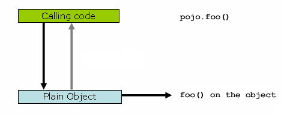

# 11.6 代理机制

Spring AOP使用JDK动态代理或CGLIB为给定目标对象创建代理。（只要有选择，JDK动态代理就是首选）。

如果要代理的目标对象实现至少一个接口，则将使用JDK动态代理。目标类型实现的所有接口都将被代理。如果目标对象未实现任何接口，则将创建CGLIB代理。

如果要强制使用CGLIB代理（例如，代理为目标对象定义的每个方法，而不仅仅是那些由其接口实现的方法），您可以这样做。但是，有一些问题需要考虑：

- `final` 方法无法建议，因为它们无法被覆盖。
- 从Spring 3.2开始，不再需要将CGLIB添加到项目类路径中，因为CGLIB类在org.springframework下重新打包并直接包含在spring-core JAR中。这意味着基于CGLIB的代理支持“正常工作”的方式与JDK动态代理总是一样。
- 从Spring 4.0开始，代理对象的构造函数将不再被调用两次，因为CGLIB代理实例将通过Objenesis创建。只有当您的JVM不允许构造函数绕过时，您才会看到Spring的AOP支持中的双重调用和相应的调试日志条目。

要强制使用CGLIB代理，请将元素`proxy-target-class`属性的值设置`<aop:config>`为true：

```xml
<aop:config proxy-target-class="true">
    <!-- other beans defined here... -->
</aop:config>
```

要在使用@AspectJ autoproxy支持时强制CGLIB代理，请将元素的`'proxy-target-class'`属性设置 `<aop:aspectj-autoproxy>`为`true`：

多个`<aop:config/>`部分在运行时折叠为单个统一的自动代理创建器，它应用指定的任何部分（通常来自不同的XML bean定义文件）的*最强*代理设置`<aop:config/>`。这也适用于`<tx:annotation-driven/>`和`<aop:aspectj-autoproxy/>` 元素。

需要明确的是：在使用`proxy-target-class="true"`上`<tx:annotation-driven/>`， `<aop:aspectj-autoproxy/>`或`<aop:config/>`元素将强制使用CGLIB代理*对他们三个*。

### 11.6.1了解AOP代理

Spring AOP是*基于代理的*。在编写自己的方面或使用Spring Framework提供的任何基于Spring AOP的方面之前，掌握最后一个语句实际意味着什么的语义是非常重要的。

首先考虑一个场景，其中有一个普通的，未代理的，没有特别关注它的直接对象引用，如下面的代码片段所示。

```java
public class SimplePojo implements Pojo {

    public void foo() {
        // this next method invocation is a direct call on the 'this' reference
        this.bar();
    }

    public void bar() {
        // some logic...
    }
}
```

如果在对象引用上调用方法，则*直接*在该对象引用上调用该方法，如下所示。



```
public class SimplePojo implements Pojo {

    public void foo() {
        // this next method invocation is a direct call on the 'this' reference
        this.bar();
    }

    public void bar() {
        // some logic...
    }
}
```

If you invoke a method on an object reference, the method is invoked *directly* on that object reference, as can be seen below.


```java
public class Main {

    public static void main(String[] args) {

        Pojo pojo = new SimplePojo();

        // this is a direct method call on the 'pojo' reference
        pojo.foo();
    }
}
```

当客户端代码具有的引用是代理时，事情会稍微改变。请考虑以下图表和代码段。


```java
public class Main {

    public static void main(String[] args) {

        ProxyFactory factory = new ProxyFactory(new SimplePojo());
        factory.addInterface(Pojo.class);
        factory.addAdvice(new RetryAdvice());

        Pojo pojo = (Pojo) factory.getProxy();

        // this is a method call on the proxy!
        pojo.foo();
    }
}
```

要了解这里的关键问题是，里面的客户端代码`main(..)`中的 `Main`类*拥有一个代理的引用*。这意味着对该对象引用的方法调用将是代理上的调用，因此代理将能够委托给与该特定方法调用相关的所有拦截器（通知）。但是，一旦调用最终到达目标对象，`SimplePojo` 在这种情况下的引用，它可能对其自身进行的任何方法调用，例如`this.bar()`or `this.foo()`，将针对*此*引用而*不是*代理进行调用。这具有重要意义。这意味着自我调用 *不是* 将导致与方法调用相关的建议有机会执行。

好的，那么该怎么办呢？最好的方法（这里松散地使用最好的术语）是重构代码，以便不会发生自我调用。当然，这确实需要你做一些工作，但这是最好的，最少侵入性的方法。接下来的方法是绝对可怕的，我几乎要谨慎地指出它，因为它是如此可怕。你可以（窒息！）通过这样做完全将你的类中的逻辑绑定到Spring AOP：

```java
public class SimplePojo implements Pojo {

    public void foo() {
        // this works, but... gah!
        ((Pojo) AopContext.currentProxy()).bar();
    }

    public void bar() {
        // some logic...
    }
}
```

这样完全将你的代码与Spring AOP，*并且*让类本身知道它是在AOP方面，它在飞行AOP面对正在使用的事实。在创建代理时，还需要一些额外的配置：

```java
public class Main {

    public static void main(String[] args) {

        ProxyFactory factory = new ProxyFactory(new SimplePojo());
        factory.adddInterface(Pojo.class);
        factory.addAdvice(new RetryAdvice());
        factory.setExposeProxy(true);

        Pojo pojo = (Pojo) factory.getProxy();

        // this is a method call on the proxy!
        pojo.foo();
    }
}
```

最后，必须注意的是AspectJ没有这种自调用问题，因为它不是基于代理的AOP框架。