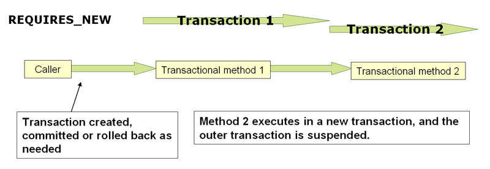

# 17.5 声明式事务管理

大多数Spring Framework用户选择声明式事务管理。此选项对应用程序代码的影响最小，因此最符合*非侵入式*轻量级容器的理想 。

使用Spring面向方面编程（AOP）可以实现Spring Framework的声明式事务管理，但是，由于事务方面代码随Spring Framework分发一起提供并且可能以样板方式使用，因此通常不必理解AOP概念有效使用此代码。

Spring Framework的声明式事务管理类似于EJB CMT，因为您可以将事务行为（或缺少它）指定为单个方法级别。`setRollbackOnly()`如有必要，可以在事务上下文中进行调用。两种类型的事务管理之间的区别是：

- 与绑定到JTA的EJB CMT不同，Spring Framework的声明式事务管理适用于任何环境。只需调整配置文件，它就可以使用JDBC，JPA，Hibernate或JDO处理JTA事务或本地事务。
- 您可以将Spring Framework声明式事务管理应用于任何类，而不仅仅是EJB等特殊类。
- Spring Framework提供了声明性 [*回滚规则*，这](transaction.html#transaction-declarative-rolling-back)是一个没有EJB等价的功能。提供了对回滚规则的编程和声明性支持。
- Spring Framework允许您使用AOP自定义事务行为。例如，您可以在事务回滚的情况下插入自定义行为。您还可以添加任意建议以及事务建议。使用EJB CMT，除了with之外，您无法影响容器的事务管理 `setRollbackOnly()`。
- Spring框架不支持跨远程调用传播事务上下文，高端应用程序服务器也是如此。如果您需要此功能，我们建议您使用EJB。但是，在使用此类功能之前请仔细考虑，因为通常情况下，人们不希望事务跨越远程调用。

**TransactionProxyFactoryBean在哪里？**

Spring 2.0及更高版本中的声明式事务配置与以前的Spring版本有很大不同。主要区别在于不再需要配置`TransactionProxyFactoryBean`bean。

Spring 2.0之前的配置样式仍然是100％有效的配置; 认为新的`<tx:tags/>`只是`TransactionProxyFactoryBean`代表你定义bean。

回滚规则的概念很重要：它们使您能够指定哪些异常（和throwable）应该导致自动回滚。您可以在配置中以声明方式指定它，而不是在Java代码中。因此，尽管您仍然可以调用`setRollbackOnly()`该`TransactionStatus`对象来回滚当前事务，但通常您可以指定`MyApplicationException`必须始终导致回滚的规则。此选项的显着优势是业务对象不依赖于事务基础结构。例如，它们通常不需要导入Spring事务API或其他Spring API。

虽然EJB容器默认行为会自动回滚 *系统异常*（通常是运行时异常）上的事务，但EJB CMT不会在*应用程序异常*（即除了之外的已检查异常`java.rmi.RemoteException`）上自动回滚事务。虽然声明式事务管理的Spring默认行为遵循EJB约定（回滚仅在未经检查的异常上自动执行），但定制此行为通常很有用。

### 17.5.1了解Spring Framework的声明式事务实现

仅仅通过注释对您的类进行`@Transactional`注释，添加`@EnableTransactionManagement`到您的配置，然后期望您了解它的工作原理是不够的 。本节介绍了在发生与事务相关的问题时Spring Framework的声明式事务基础结构的内部工作原理。

关于Spring Framework的声明式事务支持，最重要的概念是[*通过AOP代理*](aop.html#aop-understanding-aop-proxies)启用此支持 ，并且事务性建议由*元数据*（当前基于XML或基于注释）驱动。AOP与事务元数据的组合产生AOP代理，该代理使用`TransactionInterceptor`与适当的`PlatformTransactionManager`实现相结合来驱动*围绕方法调用的*事务。

从概念上讲，在事务代理上调用方法看起来像这样......


### 17.5.2声明式事务实现示例

请考虑以下接口及其附带实现。此示例使用 `Foo`和`Bar`类作为占位符，以便您可以专注于事务使用，而无需关注特定的域模型。出于本示例的目的，`DefaultFooService`类`UnsupportedOperationException` 在每个实现的方法的主体中抛出实例的事实是好的; 它允许您查看创建的事务，然后回滚以响应`UnsupportedOperationException`实例。

```java
// the service interface that we want to make transactional

package x.y.service;

public interface FooService {

    Foo getFoo(String fooName);

    Foo getFoo(String fooName, String barName);

    void insertFoo(Foo foo);

    void updateFoo(Foo foo);

}
```

```java
// an implementation of the above interface

package x.y.service;

public class DefaultFooService implements FooService {

    public Foo getFoo(String fooName) {
        throw new UnsupportedOperationException();
    }

    public Foo getFoo(String fooName, String barName) {
        throw new UnsupportedOperationException();
    }

    public void insertFoo(Foo foo) {
        throw new UnsupportedOperationException();
    }

    public void updateFoo(Foo foo) {
        throw new UnsupportedOperationException();
    }

}
```

假设前两个方法`FooService`的接口，`getFoo(String)`并且 `getFoo(String, String)`，必须与只读语义的事务上下文中执行，而其他方法，`insertFoo(Foo)`并且`updateFoo(Foo)`，必须与读写语义的事务上下文中执行。以下配置将在接下来的几段中详细说明。

```xml
<!-- from the file 'context.xml' -->
<?xml version="1.0" encoding="UTF-8"?>
<beans xmlns="http://www.springframework.org/schema/beans"
    xmlns:xsi="http://www.w3.org/2001/XMLSchema-instance"
    xmlns:aop="http://www.springframework.org/schema/aop"
    xmlns:tx="http://www.springframework.org/schema/tx"
    xsi:schemaLocation="
        http://www.springframework.org/schema/beans
        https://www.springframework.org/schema/beans/spring-beans.xsd
        http://www.springframework.org/schema/tx
        https://www.springframework.org/schema/tx/spring-tx.xsd
        http://www.springframework.org/schema/aop
        https://www.springframework.org/schema/aop/spring-aop.xsd">

    <!-- this is the service object that we want to make transactional -->
    <bean id="fooService" class="x.y.service.DefaultFooService"/>

    <!-- the transactional advice (what 'happens'; see the <aop:advisor/> bean below) -->
    <tx:advice id="txAdvice" transaction-manager="txManager">
        <!-- the transactional semantics... -->
        <tx:attributes>
            <!-- all methods starting with 'get' are read-only -->
            <tx:method name="get*" read-only="true"/>
            <!-- other methods use the default transaction settings (see below) -->
            <tx:method name="*"/>
        </tx:attributes>
    </tx:advice>

    <!-- ensure that the above transactional advice runs for any execution
        of an operation defined by the FooService interface -->
    <aop:config>
        <aop:pointcut id="fooServiceOperation" expression="execution(* x.y.service.FooService.*(..))"/>
        <aop:advisor advice-ref="txAdvice" pointcut-ref="fooServiceOperation"/>
    </aop:config>

    <!-- don't forget the DataSource -->
    <bean id="dataSource" class="org.apache.commons.dbcp.BasicDataSource" destroy-method="close">
        <property name="driverClassName" value="oracle.jdbc.driver.OracleDriver"/>
        <property name="url" value="jdbc:oracle:thin:@rj-t42:1521:elvis"/>
        <property name="username" value="scott"/>
        <property name="password" value="tiger"/>
    </bean>

    <!-- similarly, don't forget the PlatformTransactionManager -->
    <bean id="txManager" class="org.springframework.jdbc.datasource.DataSourceTransactionManager">
        <property name="dataSource" ref="dataSource"/>
    </bean>

    <!-- other <bean/> definitions here -->

</beans>
```

检查前面的配置。您想要创建服务对象，`fooService` bean，事务性。要应用的事务语义封装在 `<tx:advice/>`定义中。该`<tx:advice/>`定义读作“ *......所有开始的方法'get'都是在只读事务的上下文中执行，而所有其他方法都是用默认的事务语义执行* ”。标记的 `transaction-manager`属性`<tx:advice/>`设置`PlatformTransactionManager`为将*驱动*事务的bean 的名称 ，在本例中为`txManager`bean。

可以省略`transaction-manager`的事务通知（属性`<tx:advice/>`），如果的bean的名字`PlatformTransactionManager`要丝具有名称`transactionManager`。如果`PlatformTransactionManager`要连接的bean具有任何其他名称，则必须`transaction-manager` 显式使用该属性，如前面的示例所示。

该`<aop:config/>`定义确保`txAdvice`bean 定义的事务通知 在程序中的适当位置执行。首先，定义一个切入点，该切入点与`FooService` 接口（`fooServiceOperation`）中定义的任何操作的执行相匹配。然后将切入点与`txAdvice` 使用顾问程序相关联。结果表明，在执行a时`fooServiceOperation`，`txAdvice`将运行定义的建议。

`<aop:pointcut/>`元素中定义的表达式是AspectJ切入点表达式; 有关Spring中切入点表达式的更多详细信息[，](aop.html)请参见[第11章，](aop.html)[*使用Spring*](aop.html)进行[*面向方面编程*](aop.html)。

常见的要求是使整个服务层具有事务性。执行此操作的最佳方法是更改切入点表达式以匹配服务层中的任何操作。例如：

```xml
<aop:config>
    <aop:pointcut id="fooServiceMethods" expression="execution(* x.y.service.*.*(..))"/>
    <aop:advisor advice-ref="txAdvice" pointcut-ref="fooServiceMethods"/>
</aop:config>
```

*在此示例中，假设所有服务接口都在x.y.service包中定义 ; 有关更多详细信息，请参见第11章，使用Spring进行面向方面编程。*

现在我们已经分析了配置，你可能会问自己，“ *好吧......但是这些配置实际上做了什么？* ”。

上面的配置将用于围绕从`fooService`bean定义创建的对象创建事务代理。代理将使用事务性建议进行配置，以便*在代理上*调用适当的方法时，将启动，挂起事务，标记为只读，依此类推，具体取决于与该方法关联的事务配置。考虑以下测试驱动上述配置的程序：

```java
public final class Boot {

    public static void main(final String[] args) throws Exception {
        ApplicationContext ctx = new ClassPathXmlApplicationContext("context.xml", Boot.class);
        FooService fooService = (FooService) ctx.getBean("fooService");
        fooService.insertFoo (new Foo());
    }
}
```

运行前面程序的输出将类似于以下内容。（为清楚起见，LogFJ输出和DefaultFooService类的insertFoo（..）方法抛出的UnsupportedOperationException的堆栈跟踪已被截断。）

```bash
<!-- the Spring container is starting up... -->
[AspectJInvocationContextExposingAdvisorAutoProxyCreator] - Creating implicit proxy for bean 'fooService' with 0 common interceptors and 1 specific interceptors

<!-- the DefaultFooService is actually proxied -->
[JdkDynamicAopProxy] - Creating JDK dynamic proxy for [x.y.service.DefaultFooService]

<!-- ... the insertFoo(..) method is now being invoked on the proxy -->
[TransactionInterceptor] - Getting transaction for x.y.service.FooService.insertFoo

<!-- the transactional advice kicks in here... -->
[DataSourceTransactionManager] - Creating new transaction with name [x.y.service.FooService.insertFoo]
[DataSourceTransactionManager] - Acquired Connection [org.apache.commons.dbcp.PoolableConnection@a53de4] for JDBC transaction

<!-- the insertFoo(..) method from DefaultFooService throws an exception... -->
[RuleBasedTransactionAttribute] - Applying rules to determine whether transaction should rollback on java.lang.UnsupportedOperationException
[TransactionInterceptor] - Invoking rollback for transaction on x.y.service.FooService.insertFoo due to throwable [java.lang.UnsupportedOperationException]

<!-- and the transaction is rolled back (by default, RuntimeException instances cause rollback) -->
[DataSourceTransactionManager] - Rolling back JDBC transaction on Connection [org.apache.commons.dbcp.PoolableConnection@a53de4]
[DataSourceTransactionManager] - Releasing JDBC Connection after transaction
[DataSourceUtils] - Returning JDBC Connection to DataSource

Exception in thread "main" java.lang.UnsupportedOperationException at x.y.service.DefaultFooService.insertFoo(DefaultFooService.java:14)
<!-- AOP infrastructure stack trace elements removed for clarity -->
at $Proxy0.insertFoo(Unknown Source)
at Boot.main(Boot.java:11)
```

### 17.5.3回滚声明性事务

上一节概述了如何在应用程序中以声明方式为类（通常是服务层类）指定事务设置的基础知识。本节介绍如何以简单的声明方式控制事务回滚。

向Spring Framework的事务基础结构指示事务的工作将被回滚的推荐方法是`Exception`从当前在事务上下文中执行的代码中抛出一个代码。Spring Framework的事务基础结构代码将捕获任何未处理的内容，`Exception`因为它会调用调用堆栈，并确定是否将事务标记为回滚。

在其默认配置中，Spring Framework的事务基础结构代码 *仅*在运行时未经检查的异常情况下标记用于回滚的事务; 也就是说，抛出的异常是一个实例或子类`RuntimeException`。（ `Error`s也将 - 默认情况下 - 导致回滚）。从事务方法抛出的已检查异常*不会*导致在默认配置中回滚。

您可以准确配置哪些`Exception`类型标记事务以进行回滚，包括已检查的异常。以下XML代码段演示了如何为已检查的特定于应用程序的`Exception`类型配置回滚。

```xml
<tx:advice id="txAdvice" transaction-manager="txManager">
    <tx:attributes>
    <tx:method name="get*" read-only="true" rollback-for="NoProductInStockException"/>
    <tx:method name="*"/>
    </tx:attributes>
</tx:advice>
```

如果您*不*希望在抛出异常时回滚事务，也可以指定“无回滚规则” 。以下示例告诉Spring Framework的事务基础结构即使面对未处理的事务也要提交话务员事务`InstrumentNotFoundException`。

```xml
<tx:advice id="txAdvice">
    <tx:attributes>
    <tx:method name="updateStock" no-rollback-for="InstrumentNotFoundException"/>
    <tx:method name="*"/>
    </tx:attributes>
</tx:advice>
```

当Spring Framework的事务基础结构捕获异常并且它参考配置的回滚规则以确定是否将事务标记为回滚时，*最强*匹配规则获胜。因此，在以下配置的情况下，除了`InstrumentNotFoundException`导致后续事务的回滚之外的任何异常。

```xml
<tx:advice id="txAdvice">
    <tx:attributes>
    <tx:method name="*" rollback-for="Throwable" no-rollback-for="InstrumentNotFoundException"/>
    </tx:attributes>
</tx:advice>
```

您还可以以*编程方式*指示所需的回滚。虽然非常简单，但这个过程非常具有侵入性，并且将您的代码紧密地耦合到Spring Framework的事务基础结构中：

```java
public void resolvePosition() {
    try {
        // some business logic...
    } catch (NoProductInStockException ex) {
        // trigger rollback programmatically
        TransactionAspectSupport.currentTransactionStatus().setRollbackOnly();
    }
}
```

强烈建议您尽可能使用声明性方法进行回滚。如果您绝对需要程序化回滚，则可以使用程序化回滚，但它的使用方式可以实现基于POJO的简洁体系结构。

### 17.5.4为不同的bean配置不同的事务语义

考虑具有多个服务层对象的情况，并且您希望对每个对象应用*完全不同的*事务配置。您可以通过定义`<aop:advisor/>`具有不同`pointcut`和 `advice-ref`属性值的不同元素来完成此操作。

作为比较，首先假设您的所有服务层类都在根`x.y.service`包中定义。要使所有作为在该包（或子包中）中定义的类的实例的bean以及以名称结尾的类`Service`具有默认事务配置，您将编写以下内容：

```xml
<?xml version="1.0" encoding="UTF-8"?>
<beans xmlns="http://www.springframework.org/schema/beans"
    xmlns:xsi="http://www.w3.org/2001/XMLSchema-instance"
    xmlns:aop="http://www.springframework.org/schema/aop"
    xmlns:tx="http://www.springframework.org/schema/tx"
    xsi:schemaLocation="
        http://www.springframework.org/schema/beans
        https://www.springframework.org/schema/beans/spring-beans.xsd
        http://www.springframework.org/schema/tx
        https://www.springframework.org/schema/tx/spring-tx.xsd
        http://www.springframework.org/schema/aop
        https://www.springframework.org/schema/aop/spring-aop.xsd">

    <aop:config>

        <aop:pointcut id="serviceOperation"
                expression="execution(* x.y.service..*Service.*(..))"/>

        <aop:advisor pointcut-ref="serviceOperation" advice-ref="txAdvice"/>

    </aop:config>

    <!-- these two beans will be transactional... -->
    <bean id="fooService" class="x.y.service.DefaultFooService"/>
    <bean id="barService" class="x.y.service.extras.SimpleBarService"/>

    <!-- ... and these two beans won't -->
    <bean id="anotherService" class="org.xyz.SomeService"/> <!-- (not in the right package) -->
    <bean id="barManager" class="x.y.service.SimpleBarManager"/> <!-- (doesn't end in 'Service') -->

    <tx:advice id="txAdvice">
        <tx:attributes>
            <tx:method name="get*" read-only="true"/>
            <tx:method name="*"/>
        </tx:attributes>
    </tx:advice>

    <!-- other transaction infrastructure beans such as a PlatformTransactionManager omitted... -->

</beans>
```

以下示例显示如何使用完全不同的事务设置配置两个不同的bean。

```xml
<?xml version="1.0" encoding="UTF-8"?>
<beans xmlns="http://www.springframework.org/schema/beans"
    xmlns:xsi="http://www.w3.org/2001/XMLSchema-instance"
    xmlns:aop="http://www.springframework.org/schema/aop"
    xmlns:tx="http://www.springframework.org/schema/tx"
    xsi:schemaLocation="
        http://www.springframework.org/schema/beans
        https://www.springframework.org/schema/beans/spring-beans.xsd
        http://www.springframework.org/schema/tx
        https://www.springframework.org/schema/tx/spring-tx.xsd
        http://www.springframework.org/schema/aop
        https://www.springframework.org/schema/aop/spring-aop.xsd">

    <aop:config>

        <aop:pointcut id="defaultServiceOperation"
                expression="execution(* x.y.service.*Service.*(..))"/>

        <aop:pointcut id="noTxServiceOperation"
                expression="execution(* x.y.service.ddl.DefaultDdlManager.*(..))"/>

        <aop:advisor pointcut-ref="defaultServiceOperation" advice-ref="defaultTxAdvice"/>

        <aop:advisor pointcut-ref="noTxServiceOperation" advice-ref="noTxAdvice"/>

    </aop:config>

    <!-- this bean will be transactional (see the 'defaultServiceOperation' pointcut) -->
    <bean id="fooService" class="x.y.service.DefaultFooService"/>

    <!-- this bean will also be transactional, but with totally different transactional settings -->
    <bean id="anotherFooService" class="x.y.service.ddl.DefaultDdlManager"/>

    <tx:advice id="defaultTxAdvice">
        <tx:attributes>
            <tx:method name="get*" read-only="true"/>
            <tx:method name="*"/>
        </tx:attributes>
    </tx:advice>

    <tx:advice id="noTxAdvice">
        <tx:attributes>
            <tx:method name="*" propagation="NEVER"/>
        </tx:attributes>
    </tx:advice>

    <!-- other transaction infrastructure beans such as a PlatformTransactionManager omitted... -->

</beans>
```

### 17.5.5 <tx:advice/>设置

本节总结了可以使用`<tx:advice/>`标记指定的各种事务设置。默认`<tx:advice/>`设置为：

- [传播设置](transaction.html#tx-propagation)是`REQUIRED.`
- 隔离级别是 `DEFAULT.`
- 事务是读/写。
- 事务超时默认为基础事务系统的默认超时，如果不支持超时，则为none。
- 任何`RuntimeException`触发器回滚，任何检查`Exception`都没有。

您可以更改这些默认设置; `<tx:method/>`嵌套在标签`<tx:advice/>`和`<tx:attributes/>`标签中的各种属性总结如下：


**表17.1。**<tx:method/>**设置**

| 属性              | 需要？ | 默认 | 描述                                                         |
| ----------------- | ------ | ---- | ------------------------------------------------------------ |
| `name`            | 是     |      | 与事务属性关联的方法名称。通配符（*）字符可用于将相同的事务属性设置与多个方法相关联; 例如`get*`，`handle*`，`on*Event`，等等。 |
| `propagation`     | 没有   | 需要 | 事务传播行为。                                               |
| `isolation`       | 没有   | 默认 | 事务隔离级别。仅适用于传播REQUIRED或REQUIRES_NEW。           |
| `timeout`         | 没有   | -1   | 事务超时（秒）。仅适用于传播REQUIRED或REQUIRES_NEW。         |
| `read-only`       | 没有   | 假   | 读/写与只读事务。仅适用于REQUIRED或REQUIRES_NEW。            |
| `rollback-for`    | 没有   |      | `Exception(s)`触发回滚; 逗号分隔。例如， `com.foo.MyBusinessException,ServletException.` |
| `no-rollback-for` | 没有   |      | `Exception(s)`那些*不*触发回退; 逗号分隔。例如， `com.foo.MyBusinessException,ServletException.` |

### 17.5.6使用@Transactional

除了基于XML的事务配置声明方法之外，您还可以使用基于注释的方法。直接在Java源代码中声明事务语义会使声明更接近受影响的代码。不存在过度耦合的危险，因为无论如何，用于事务处理的代码几乎总是以这种方式部署。

标准`javax.transaction.Transactional`注释也支持作为Spring自己的注释的替代品。有关更多详细信息，请参阅JTA 1.2文档。

通过使用`@Transactional`注释提供的易用性最好通过示例来说明，该示例在随后的文本中解释。考虑以下类定义：

```java
// the service class that we want to make transactional
@Transactional
public class DefaultFooService implements FooService {

    Foo getFoo(String fooName);

    Foo getFoo(String fooName, String barName);

    void insertFoo(Foo foo);

    void updateFoo(Foo foo);
}
```

如上所述在类级别使用，注释指示声明类（及其子类）的所有方法的默认值。或者，每个方法都可以单独注释。请注意，类级别注释不适用于类层次结构中的祖先类; 在这种情况下，需要在本地重新声明方法才能参与子类级别的注释。

当上述POJO被定义为在一个Spring IoC容器一个bean，bean实例可以通过添加仅进行事务*一个* XML配置的线：

```xml
<!-- from the file 'context.xml' -->
<?xml version="1.0" encoding="UTF-8"?>
<beans xmlns="http://www.springframework.org/schema/beans"
    xmlns:xsi="http://www.w3.org/2001/XMLSchema-instance"
    xmlns:aop="http://www.springframework.org/schema/aop"
    xmlns:tx="http://www.springframework.org/schema/tx"
    xsi:schemaLocation="
        http://www.springframework.org/schema/beans
        https://www.springframework.org/schema/beans/spring-beans.xsd
        http://www.springframework.org/schema/tx
        https://www.springframework.org/schema/tx/spring-tx.xsd
        http://www.springframework.org/schema/aop
        https://www.springframework.org/schema/aop/spring-aop.xsd">

    <!-- this is the service object that we want to make transactional -->
    <bean id="fooService" class="x.y.service.DefaultFooService"/>

    <!-- enable the configuration of transactional behavior based on annotations -->
    <tx:annotation-driven transaction-manager="txManager"/><!-- a PlatformTransactionManager is still required -->

    <bean id="txManager" class="org.springframework.jdbc.datasource.DataSourceTransactionManager">
        <!-- (this dependency is defined somewhere else) -->
        <property name="dataSource" ref="dataSource"/>
    </bean>

    <!-- other <bean/> definitions here -->

</beans>
```

您可以省略`transaction-manager`属性的`<tx:annotation-driven/>`标签，如果的bean的名字`PlatformTransactionManager`要丝具有名称`transactionManager`。如果`PlatformTransactionManager`要依赖注入的bean具有任何其他名称，则必须`transaction-manager` 显式使用该属性，如前面的示例所示。

该`@EnableTransactionManagement`注释提供同样的支持，如果你使用的是基于Java的配置。只需将注释添加到`@Configuration`类中即可。有关详细信息，请参阅javadocs。

**方法可见性和@Transactional**

使用代理时，应仅将`@Transactional`注释应用于具有*公共*可见性的方法。如果使用注释注释protected，private或package-visible方法，则`@Transactional`不会引发错误，但带注释的方法不会显示已配置的事务设置。如果需要注释非公共方法，请考虑使用AspectJ（见下文）。

您可以将`@Transactional`注释放在接口定义，接口上的方法，类定义或类的*公共*方法之前。但是，仅仅存在`@Transactional`注释不足以激活事务行为。该`@Transactional`注释很简单，可以通过一些运行时基础架构即消耗的元数据`@Transactional`知晓的，并且可以使用元数据与交易行为的配置适当的豆。在前面的示例中，`<tx:annotation-driven/>`元素*将切换*事务行为。

Spring建议您只使用注释来注释具体类（以及具体类的方法）`@Transactional`，而不是注释接口。您当然可以将`@Transactional`注释放在接口（或接口方法）上，但这只能在您使用基于接口的代理时按预期工作。Java注释*不是从接口继承*的事实意味着如果您使用基于类的代理（`proxy-target-class="true"`）或基于编织的方面（`mode="aspectj"`），则代理和编织基础结构无法识别事务设置，并且对象不会被包装在事务代理中，这将是非常*糟糕的*。

在代理模式（默认设置）下，只拦截通过代理进入的外部方法调用。这意味着实际上，自调用目标对象中的一个方法调用目标对象的另一个方法，即使调用了被调用的方法，也不会在运行时导致实际的事务`@Transactional`。此外，必须完全初始化代理以提供预期的行为，因此您不应该在初始化代码中依赖此功能，即`@PostConstruct`。

如果您希望自我调用也包含在事务中，请考虑使用AspectJ模式（请参阅下表中的mode属性）。在这种情况下，首先不会有代理; 相反，目标类将被编织（即，它的字节代码将被修改），以便`@Transactional`在任何类型的方法上变成运行时行为。

**表17.2。注释驱动的事务设置**

| XML属性               | 注释属性                                             | 默认                      | 描述                                                         |
| --------------------- | ---------------------------------------------------- | ------------------------- | ------------------------------------------------------------ |
| `transaction-manager` | N / A（见`TransactionManagementConfigurer`javadocs） | transactionManager的      | 要使用的事务管理器的名称。仅在事务管理器的名称不是时才需要`transactionManager`，如上例所示。 |
| `mode`                | `mode`                                               | 代理                      | 默认模式“proxy”使用Spring的AOP框架处理带注释的bean（遵循代理语义，如上所述，仅适用于通过代理进入的方法调用）。替代模式“aspectj”用Spring的AspectJ事务方面编织受影响的类，修改目标类字节代码以应用于任何类型的方法调用。AspectJ编织需要在类路径中使用spring-aspects.jar以及启用加载时编织（或编译时编织）。（有关如何设置加载时编织的详细信息，请参阅[“弹簧配置”一节](aop.html#aop-aj-ltw-spring)。） |
| `proxy-target-class`  | `proxyTargetClass`                                   | 假                        | 仅适用于代理模式。控制为使用`@Transactional`注释注释的类创建的事务代理类型。如果`proxy-target-class`属性设置为`true`，则创建基于类的代理。如果`proxy-target-class`是`false`或者省略了该属性，则创建基于标准JDK接口的代理。（有关不同代理类型的详细检查，请参见[第11.6节“代理机制”](aop.html#aop-proxying)。） |
| `order`               | `order`                                              | Ordered.LOWEST_PRECEDENCE | 定义应用于使用注释的bean的事务通知的顺序 `@Transactional`。（有关与AOP建议排序相关的规则的更多信息，请参阅[“建议排序”一节](aop.html#aop-ataspectj-advice-ordering)。）没有指定的排序意味着AOP子系统确定建议的顺序。 |

处理`@Transactional`注释的默认建议模式是“代理”，它允许仅通过代理拦截调用; 同一类中的本地调用不能以这种方式截获。对于更高级的拦截模式，请考虑结合编译/加载时编织切换到“aspectj”模式。

该`proxy-target-class`属性控制为使用`@Transactional`注释注释的类创建的事务代理类型。如果 `proxy-target-class`设置为`true`，则创建基于类的代理。如果 `proxy-target-class`是`false`或者省略了属性，则创建基于标准JDK接口的代理。（有关不同代理类型的讨论，请参见[第11.6节“代理机制”](aop.html#aop-proxying)。）

`@EnableTransactionManagement`并且`<tx:annotation-driven/>`只查找 `@Transactional`它们所定义的相同应用程序上下文中的bean。这意味着，如果将注释驱动配置放在`WebApplicationContext`for中`DispatcherServlet`，它只检查`@Transactional`控制器中的bean，而不检查服务。有关更多信息[，](mvc.html#mvc-servlet)请参见[第22.2节“DispatcherServlet”](mvc.html#mvc-servlet)。

在评估方法的事务设置时，派生最多的位置优先。在以下示例的情况下，`DefaultFooService`类在类级别使用只读事务的设置进行`@Transactional`注释，但`updateFoo(Foo)`同一类中方法的 注释优先于类级别定义的事务设置。

```java
@Transactional(readOnly = true)
public class DefaultFooService implements FooService {

    public Foo getFoo(String fooName) {
        // do something
    }

    // these settings have precedence for this method
    @Transactional(readOnly = false, propagation = Propagation.REQUIRES_NEW)
    public void updateFoo(Foo foo) {
        // do something
    }
}
```

#### @Transactional设置

该`@Transactional`注解的是，指定的接口，类或方法必须具有事务语义的元数据; 例如，“ *在调用此方法时启动全新的只读事务，暂停任何现有事务* ”。默认`@Transactional`设置如下：

- 传播设置是 `PROPAGATION_REQUIRED.`
- 隔离级别是 `ISOLATION_DEFAULT.`
- 事务是读/写。
- 事务超时默认为基础事务系统的默认超时，如果不支持超时，则默认为none。
- 任何`RuntimeException`触发器回滚，任何检查`Exception`都没有。

可以更改这些默认设置; `@Transactional` 注释的各种属性总结在下表中：


**表17.3。@Transactional设置**

| 属性                                                         | 类型                                       | 描述                                                 |
| ------------------------------------------------------------ | ------------------------------------------ | ---------------------------------------------------- |
| [值](transaction.html#tx-multiple-tx-mgrs-with-attransactional) | 串                                         | 可选限定符，指定要使用的事务管理器。                 |
| [传播](transaction.html#tx-propagation)                      | 枚举： `Propagation`                       | 可选的传播设置。                                     |
| `isolation`                                                  | 枚举： `Isolation`                         | 可选的隔离级别。仅适用于传播REQUIRED或REQUIRES_NEW。 |
| `timeout`                                                    | int（以秒为单位）                          | 可选的事务超时。仅适用于传播REQUIRED或REQUIRES_NEW。 |
| `readOnly`                                                   | 布尔                                       | 读/写与只读事务。仅适用于REQUIRED或REQUIRES_NEW。    |
| `rollbackFor`                                                | `Class`必须从中派生的对象数组`Throwable.`  | *必须*引发回滚的可选异常类数组。                     |
| `rollbackForClassName`                                       | 类名数组。必须从中派生类`Throwable.`       | *必须*导致回滚的可选异常类名称数组。                 |
| `noRollbackFor`                                              | `Class`必须从中派生的对象数组`Throwable.`  | 可选的异常类数组，*不得*导致回滚。                   |
| `noRollbackForClassName`                                     | `String`类名数组，必须从中派生`Throwable.` | 可选*不会*导致回滚的异常类名称的可选数组。           |

目前，您无法明确控制事务的名称，其中“name”表示将在事务监视器中显示的事务名称（如果适用）（例如，WebLogic的事务监视器）以及日志记录输出。对于声明性事务，事务名称始终是完全限定的类名+“。”。+事务建议类的方法名称。例如，如果类的 `handlePayment(..)`方法`BusinessService`启动了事务，则事务的名称将为：`com.foo.BusinessService.handlePayment`。

#### 使用@Transactional的多个事务

大多数Spring应用程序只需要一个事务管理器，但在某些情况下，您可能需要在单个应用程序中使用多个独立的事务管理器。`@Transactional`注释的value属性可用于选择性地指定要使用的标识`PlatformTransactionManager`。这可以是bean名称或事务管理器bean的限定符值。例如，使用限定符表示法，以下Java代码

```java
public class TransactionalService {

    @Transactional("order")
    public void setSomething(String name) { ... }

    @Transactional("account")
    public void doSomething() { ... }
}
```

可以与应用程序上下文中的以下事务管理器bean声明结合使用。

```xml
<tx:annotation-driven/>

    <bean id="transactionManager1" class="org.springframework.jdbc.datasource.DataSourceTransactionManager">
        ...
        <qualifier value="order"/>
    </bean>

    <bean id="transactionManager2" class="org.springframework.jdbc.datasource.DataSourceTransactionManager">
        ...
        <qualifier value="account"/>
    </bean>
```

在这种情况下，两个方法`TransactionalService`将在单独的事务管理器下运行，由“order”和“account”限定符区分。如果未找到特定限定的PlatformTransactionManager bean，仍将使用默认`<tx:annotation-driven>`目标bean名称`transactionManager`。

#### 自定义快捷方式注释

如果您发现`@Transactional`在多种不同方法中重复使用相同的属性，则[Spring的元注释支持](beans.html#beans-meta-annotations)允许您为特定用例定义自定义快捷方式注释。例如，定义以下注释

```java
@Target({ElementType.METHOD, ElementType.TYPE})
@Retention(RetentionPolicy.RUNTIME)
@Transactional("order")
public @interface OrderTx {
}

@Target({ElementType.METHOD, ElementType.TYPE})
@Retention(RetentionPolicy.RUNTIME)
@Transactional("account")
public @interface AccountTx {
}
```

允许我们将上一节中的示例编写为

```java
public class TransactionalService {

    @OrderTx
    public void setSomething(String name) { ... }

    @AccountTx
    public void doSomething() { ... }
}
```

里我们使用语法来定义事务管理器限定符，但也可以包含传播行为，回滚规则，超时等。

### 17.5.7事务传播

本节描述了Spring中事务传播的一些语义。请注意，本节不是适当的交易传播介绍; 相反，它详细介绍了Spring中有关事务传播的一些语义。

在Spring管理的事务中，请注意*物理*和 *逻辑*事务之间的区别，以及传播设置如何应用于此差异。

#### 需要


PROPAGATION_REQUIRED

当传播设置为时`PROPAGATION_REQUIRED`，将为应用设置的每个方法创建*逻辑*事务范围。每个这样的逻辑事务范围可以单独确定仅回滚状态，外部事务范围在逻辑上独立于内部事务范围。当然，在标准`PROPAGATION_REQUIRED`行为的情况下，所有这些范围将映射到同一物理事务。因此，内部事务范围中的仅回滚标记集确实会影响外部事务实际提交的机会（正如您所期望的那样）。

但是，在内部事务作用域设置仅回滚标记的情况下，外部事务尚未决定回滚本身，因此回滚（由内部事务作用域静默触发）是意外的。`UnexpectedRollbackException`在那一点上抛出相应的对应 物。这是*预期的行为，*因此事务的调用者永远不会被误导以假定在实际上没有执行提交。因此，如果内部事务（外部调用者不知道）以静默方式将事务标记为仅回滚，则外部调用者仍会调用commit。外部调用者需要接收一个`UnexpectedRollbackException`以清楚地表明已执行回滚。

#### RequiresNew



PROPAGATION_REQUIRES_NEW

`PROPAGATION_REQUIRES_NEW`与此相反`PROPAGATION_REQUIRED`，始终对每个受影响的事务范围使用 *独立的*物理事务，从不参与外部范围的现有事务。在这样的安排中，底层资源事务是不同的，因此可以独立地提交或回滚，外部事务不受内部事务的回滚状态的影响，并且内部事务的锁在完成后立即释放。这样一个独立的内部事务也可以声明它自己的隔离级别，超时和只读设置，从不继承外部事务的特性。

#### 嵌套

`PROPAGATION_NESTED`使用具有多个保存点的*单个*物理事务，它可以回滚到该事务。这种部分回滚允许内部事务作用域触发*其作用域*的回滚，外部事务能够继续物理事务，尽管已经回滚了一些操作。此设置通常映射到JDBC保存点，因此仅适用于JDBC资源事务。见春天`DataSourceTransactionManager`。

### 17.5.8建议交易操作

假设你要执行*这两个*事务*和*一些基本的分析建议。你是如何在这种情况下实现这一点的`<tx:annotation-driven/>`？

调用`updateFoo(Foo)`方法时，您希望看到以下操作：

- 配置的性能分析方面启动。
- 交易建议执行。
- 建议对象的方法执行。
- 交易提交。
- 分析方面报告整个事务方法调用的确切持续时间。

本章不涉及详细解释AOP（除非适用于交易）。有关以下AOP配置和AOP的详细介绍，请参见[第11章，*使用Spring*](aop.html)进行[*面向方面编程*](aop.html)。

这是上面讨论的简单分析方面的代码。通过`Ordered`界面控制建议的顺序。有关建议订购的完整详细信息，请参阅 [[the section called “Advice ordering”](aop.html#aop-ataspectj-advice-ordering). .

```java
package x.y;

import org.aspectj.lang.ProceedingJoinPoint;
import org.springframework.util.StopWatch;
import org.springframework.core.Ordered;

public class SimpleProfiler implements Ordered {

    private int order;

    // allows us to control the ordering of advice
    public int getOrder() {
        return this.order;
    }

    public void setOrder(int order) {
        this.order = order;
    }

    // this method is the around advice
    public Object profile(ProceedingJoinPoint call) throws Throwable {
        Object returnValue;
        StopWatch clock = new StopWatch(getClass().getName());
        try {
            clock.start(call.toShortString());
            returnValue = call.proceed();
        } finally {
            clock.stop();
            System.out.println(clock.prettyPrint());
        }
        return returnValue;
    }
}
```

```xml
<?xml version="1.0" encoding="UTF-8"?>
<beans xmlns="http://www.springframework.org/schema/beans"
    xmlns:xsi="http://www.w3.org/2001/XMLSchema-instance"
    xmlns:aop="http://www.springframework.org/schema/aop"
    xmlns:tx="http://www.springframework.org/schema/tx"
    xsi:schemaLocation="
        http://www.springframework.org/schema/beans
        https://www.springframework.org/schema/beans/spring-beans.xsd
        http://www.springframework.org/schema/tx
        https://www.springframework.org/schema/tx/spring-tx.xsd
        http://www.springframework.org/schema/aop
        https://www.springframework.org/schema/aop/spring-aop.xsd">

    <bean id="fooService" class="x.y.service.DefaultFooService"/>

    <!-- this is the aspect -->
    <bean id="profiler" class="x.y.SimpleProfiler">
        <!-- execute before the transactional advice (hence the lower order number) -->
        <property name="order" value="1"/>
    </bean>

    <tx:annotation-driven transaction-manager="txManager" order="200"/>

    <aop:config>
            <!-- this advice will execute around the transactional advice -->
            <aop:aspect id="profilingAspect" ref="profiler">
                <aop:pointcut id="serviceMethodWithReturnValue"
                        expression="execution(!void x.y..*Service.*(..))"/>
                <aop:around method="profile" pointcut-ref="serviceMethodWithReturnValue"/>
            </aop:aspect>
    </aop:config>

    <bean id="dataSource" class="org.apache.commons.dbcp.BasicDataSource" destroy-method="close">
        <property name="driverClassName" value="oracle.jdbc.driver.OracleDriver"/>
        <property name="url" value="jdbc:oracle:thin:@rj-t42:1521:elvis"/>
        <property name="username" value="scott"/>
        <property name="password" value="tiger"/>
    </bean>

    <bean id="txManager" class="org.springframework.jdbc.datasource.DataSourceTransactionManager">
        <property name="dataSource" ref="dataSource"/>
    </bean>

</beans>
```

上述配置的结果是一个`fooService`bean，它具有以*所需顺序*应用于它的分析和事务方面。您可以以类似的方式配置任意数量的其他方面。

以下示例实现与上面相同的设置，但使用纯XML声明方法。

```xml
<?xml version="1.0" encoding="UTF-8"?>
<beans xmlns="http://www.springframework.org/schema/beans"
    xmlns:xsi="http://www.w3.org/2001/XMLSchema-instance"
    xmlns:aop="http://www.springframework.org/schema/aop"
    xmlns:tx="http://www.springframework.org/schema/tx"
    xsi:schemaLocation="
        http://www.springframework.org/schema/beans
        https://www.springframework.org/schema/beans/spring-beans.xsd
        http://www.springframework.org/schema/tx
        https://www.springframework.org/schema/tx/spring-tx.xsd
        http://www.springframework.org/schema/aop
        https://www.springframework.org/schema/aop/spring-aop.xsd">

    <bean id="fooService" class="x.y.service.DefaultFooService"/>

    <!-- the profiling advice -->
    <bean id="profiler" class="x.y.SimpleProfiler">
        <!-- execute before the transactional advice (hence the lower order number) -->
        <property name="order" value="1"/>
    </bean>

    <aop:config>
        <aop:pointcut id="entryPointMethod" expression="execution(* x.y..*Service.*(..))"/>
        <!-- will execute after the profiling advice (c.f. the order attribute) -->

        <aop:advisor advice-ref="txAdvice" pointcut-ref="entryPointMethod" order="2"/>
        <!-- order value is higher than the profiling aspect -->

        <aop:aspect id="profilingAspect" ref="profiler">
            <aop:pointcut id="serviceMethodWithReturnValue"
                    expression="execution(!void x.y..*Service.*(..))"/>
            <aop:around method="profile" pointcut-ref="serviceMethodWithReturnValue"/>
        </aop:aspect>

    </aop:config>

    <tx:advice id="txAdvice" transaction-manager="txManager">
        <tx:attributes>
            <tx:method name="get*" read-only="true"/>
            <tx:method name="*"/>
        </tx:attributes>
    </tx:advice>

    <!-- other <bean/> definitions such as a DataSource and a PlatformTransactionManager here -->

</beans>
```

上述配置的结果将是一个`fooService`bean，它具有*按该顺序*应用于它的分析和事务方面。如果您希望在路上的事务性建议*之后*以及在出路的事务性建议*之前*执行性能分析建议，那么您只需交换性能分析方面bean的`order`属性的值，使其高于事务性建议的订单值。

您可以以类似的方式配置其他方面。

### 17.5.9将@Transactional与AspectJ一起使用

也可以`@Transactional`通过AspectJ方面在Spring容器外部使用Spring Framework的支持。为此，首先使用注释对类（以及可选的类的方法）进行`@Transactional`注释，然后使用文件中`org.springframework.transaction.aspectj.AnnotationTransactionAspect`定义 的应用程序链接（编织）应用程序`spring-aspects.jar`。还必须使用事务管理器配置方面。您当然可以使用Spring Framework的IoC容器来处理依赖注入方面。配置事务管理方面的最简单方法是使用`<tx:annotation-driven/>`元素并指定`mode` 属性，`aspectj`如[第17.5.6节“使用@Transactional”中所述](transaction.html#transaction-declarative-annotations)。因为我们专注于在Spring容器外运行的应用程序，所以我们将向您展示如何以编程方式执行它。

```java
//构造一个合适的事务管理器 
DataSourceTransactionManager txManager = new DataSourceTransactionManager（getDataSource（））;

//配置AnnotationTransactionAspect以使用它; 这必须在执行任何事务方法之前完成 
AnnotationTransactionAspect.aspectOf（）。setTransactionManager（txManager）;
```

使用此方面时，必须注释*实现*类（和/或该类中的方法），*而不是*该类实现的接口（如果有）。AspectJ遵循Java的规则，即接口上的注释*不会被继承*。

`@Transactional`类上的注释指定了在类中执行任何公共方法的默认事务语义。

`@Transactional`类中方法的注释会覆盖类注释（如果存在）给出的默认事务语义。无论可见性如何，都可以注释任何方法。

要编写应用程序，`AnnotationTransactionAspect`必须使用AspectJ构建应用程序（请参阅 [AspectJ开发指南](https://www.eclipse.org/aspectj/doc/released/devguide/index.html)）或使用加载时编织。有关[使用AspectJ进行加载时编织](aop.html#aop-aj-ltw)的讨论，请参见[第11.8.4节“在Spring Framework中使用AspectJ](aop.html#aop-aj-ltw)进行加载时编织”。